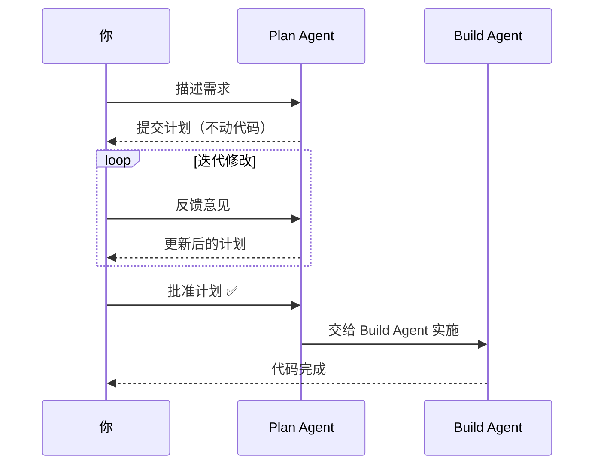
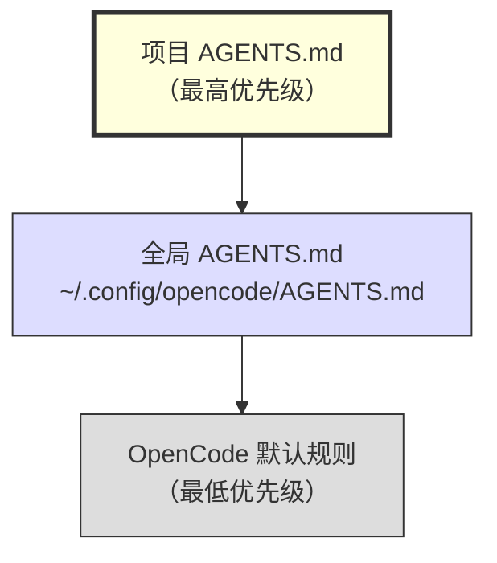
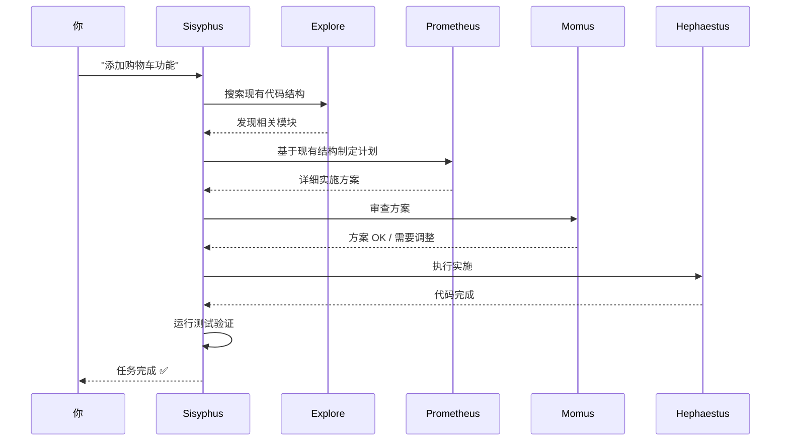
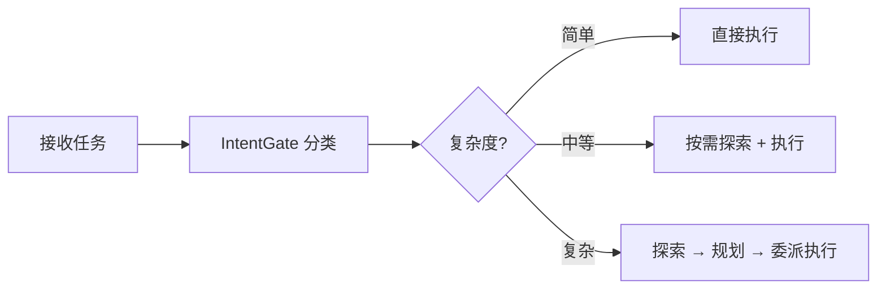
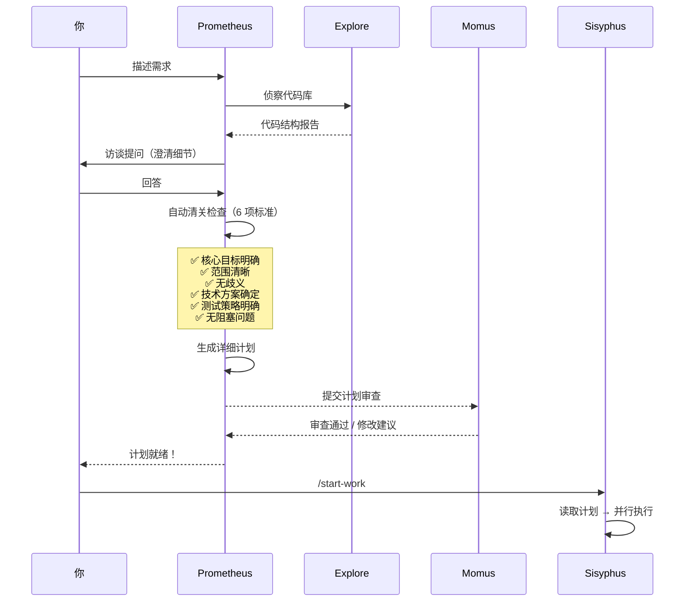
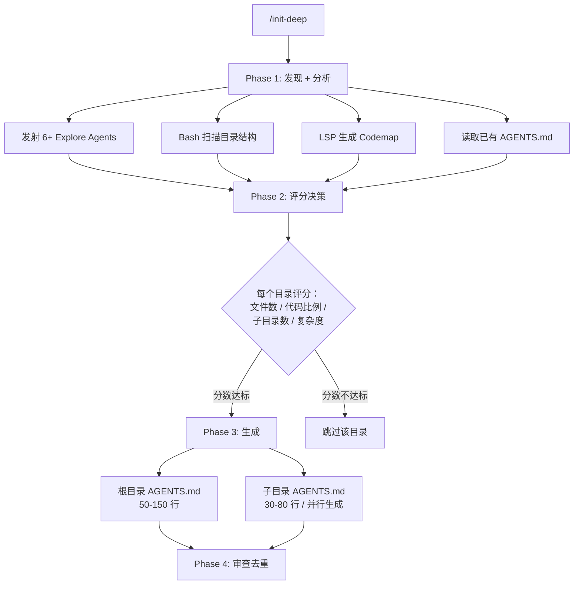
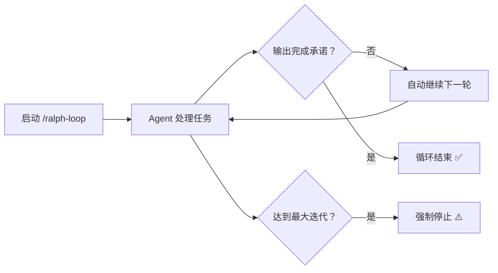
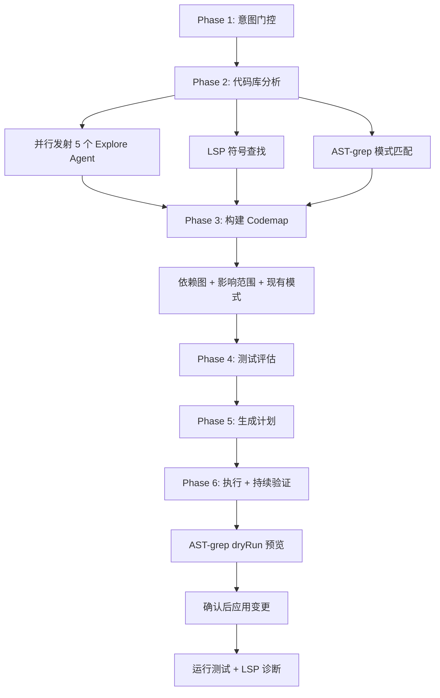
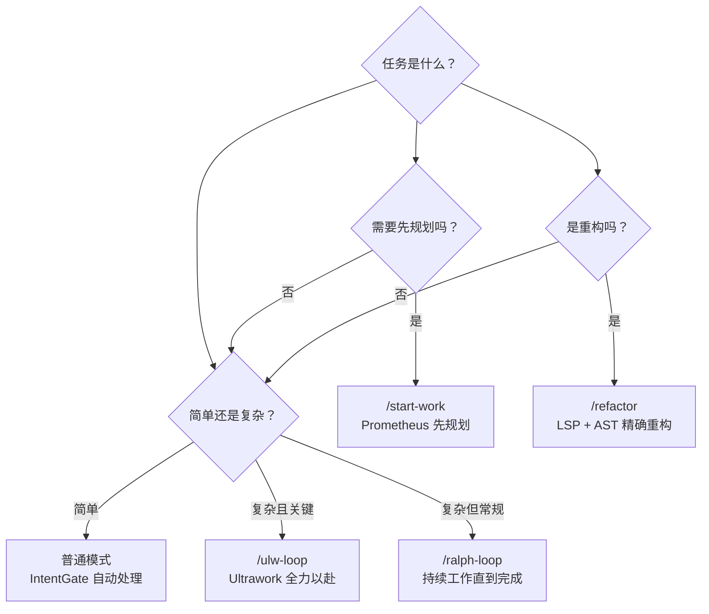

# Vibe Coding with OpenCode：从零开始的完全指南

> **版本**：2026 年 3 月 · **面向读者**：零基础新手
> **前置条件**：会用终端（Terminal）、了解基本编程概念即可

---

## 目录

- [快速上手（5 分钟）](#快速上手5-分钟)
- [第一章 什么是 Vibe Coding](#第一章-什么是-vibe-coding)
- [第二章 工具选择与模型指南](#第二章-工具选择与模型指南)
- [第三章 安装与配置](#第三章-安装与配置)
- [第四章 界面与基本操作](#第四章-界面与基本操作)
- [第五章 AGENTS.md：项目的"宪法"](#第五章-agentsmd项目的宪法)
- [第六章 提示词工程：和 AI 有效沟通](#第六章-提示词工程和-ai-有效沟通)
- [第七章 上下文管理](#第七章-上下文管理)
- [第八章 Skills 与 Superpowers：AI 的专项技能](#第八章-skills-与-superpowersai-的专项技能)
- [第九章 工作流编排插件](#第九章-工作流编排插件)
- [第十章 MCP：连接外部世界](#第十章-mcp连接外部世界)
- [第十一章 实战案例](#第十一章-实战案例)
- [第十二章 安全与权限](#第十二章-安全与权限)
- [第十三章 进阶技巧与最佳实践](#第十三章-进阶技巧与最佳实践)
- [附录](#附录)

---

## 快速上手（5 分钟）

> 如果你迫不及待想体验 Vibe Coding，按以下步骤操作。详细解释请阅读后续章节。

```bash
# 1. 安装 OpenCode
curl -fsSL https://opencode.ai/install | bash

# 2. 进入你的项目目录
cd your-project

# 3. 启动 OpenCode
opencode

# 4. 连接 LLM 提供商（二选一）
opencode auth login          # 命令行方式，会列出所有支持的提供商供你选择
# 或在 OpenCode 内输入 /connect（效果相同）
# 详见第三章 3.2 认证配置

# 5. 初始化项目（自动生成 AGENTS.md）
/init

# 6. 开始对话！
帮我创建一个 Express.js 的 Hello World 项目
```

就是这么简单。接下来的章节会帮你理解每一步背后的原理，以及如何用好这些工具。

---

## 第一章 什么是 Vibe Coding

### 1.1 起源

2025 年 2 月 6 日，OpenAI 联合创始人、前特斯拉 AI 总监 **Andrej Karpathy** 在 X（Twitter）上发布了一条帖子：

> "There's a new kind of coding I call **'vibe coding'**, where you fully give in to the vibes, embrace exponentials, and forget that the code even exists."

他描述了一种全新的编程方式——不再逐行编写代码，而是用自然语言描述你的意图，让 AI 生成代码，然后通过"感觉"（vibe）来判断结果是否正确。

这个概念迅速引爆了技术社区。到 2025 年底，"Vibe Coding" 被 **柯林斯英语词典** 评为年度词汇，被 **韦氏词典** 收录为流行术语。

### 1.2 定义

```
Vibe Coding ≠ AI 帮你补全代码
Vibe Coding = 你用自然语言描述意图，AI 完成编码，你负责验证和引导
```

Django 联合创建者 Simon Willison 提出了一个关键区分：

> "如果 AI 写了每一行代码，但你逐行审查、测试、理解了所有代码，那不是 Vibe Coding——那只是把 AI 当成了打字助手。"

Vibe Coding 的本质是**信任与委托**：你信任 AI 的能力，将编码工作委托给它，自己专注于更高层次的决策。

### 1.3 编程范式的演进

| 阶段 | 模式 | 特征 |
|------|------|------|
| **阶段一** | 人工编程 | 开发者手写全部代码 |
| **阶段二** | AI 辅助 | AI 补全代码片段，开发者主导 |
| **阶段三** ⬅ 当前 | **Vibe Coding** | 开发者描述意图，AI 完成编码，开发者验证结果 |
| **阶段四** | 全自动 | AI 自主完成全流程（尚未成熟） |

我们目前正处于**阶段三**。开发者的角色发生了根本性转变：

| | 传统开发 | Vibe Coding |
|---|---|---|
| **核心工作** | 写代码（80%）+ 设计/测试（20%） | 表达意图（20%）+ 验证/引导（80%） |
| **关键技能** | 语法、算法、调试 | 需求表达、架构判断、AI 沟通 |
| **工作单元** | 代码行 | 对话轮次 |
| **出错时** | 看报错、打断点 | 描述现象、让 AI 修复 |

### 1.4 适用场景与局限

**✅ Vibe Coding 擅长的：**
- 中小型项目的快速原型开发
- CRUD 类应用（Web 前后端、API）
- 需要极宽知识面但对深度要求不太高的项目（如全栈项目——前端、后端、数据库、部署等都要懂一点，AI 恰好每样都知道）
- 有清晰需求和良好规划的项目
- 重复性、模板化的工作
- 学习新技术框架（让 AI 做示例）

**⚠️ Vibe Coding 的局限：**

| 局限 | 原因 | 应对方式 |
|------|------|----------|
| 上下文窗口有限 | 模型一次能"记住"的内容有限 | 良好的上下文管理策略（[第七章](#第七章-上下文管理)） |
| 需求表达难 | 自然语言天然有歧义 | 学习提示词工程（[第六章](#第六章-提示词工程和-ai-有效沟通)） |
| 运维能力弱 | AI 可能执行危险操作 | 权限隔离与沙箱（[第十二章](#第十二章-安全与权限)） |
| 大型项目 | 代码量超出上下文窗口 | 分模块处理、合理架构 |

### 1.5 成功公式

Vibe Coding 的效果取决于三个要素，**缺一不可**：

| 要素 | 说明 | 本指南覆盖 |
|------|------|-----------|
| **好工具** | OpenCode, Cursor, Claude Code 等 | 第二~四章 |
| **好模型** | Claude Opus/Sonnet, Gemini Pro, GPT-5 等 | 第二章 |
| **好技巧** | 提示词工程、上下文管理、工作流编排 | 第五~九章 |

本指南将帮助你掌握全部三个要素。

---

## 第二章 工具选择与模型指南

### 2.1 工具选择原则

> ⚠️ 优先使用主流 LLM 厂商的**官方工具**，或大公司出品的成熟产品。OpenCode 是唯一推荐的社区开源工具（因其开源、安全、社区活跃）。

| 工具 | 厂商/性质 | 特点 | 推荐度 |
|------|----------|------|--------|
| **OpenCode** ⭐ | 开源社区 | 75+ 模型、丰富插件生态、CLI/Web/桌面、120K+ Stars | ⭐⭐⭐⭐⭐ |
| **Claude Code** | Anthropic 官方 | 深度集成 Claude 模型，开箱即用 | ⭐⭐⭐⭐ |
| **Cursor** | 微软投资的 IDE | 图形化界面，上手最快 | ⭐⭐⭐⭐ |
| **GitHub Copilot** | 微软/GitHub | IDE 内集成，适合渐进式使用 | ⭐⭐⭐⭐ |
| **Codex CLI** | OpenAI 官方 | 开源，专注 OpenAI 模型 | ⭐⭐⭐ |
| **Gemini CLI** | Google 官方 | 开源，1M 上下文，有免费额度 | ⭐⭐⭐ |
| **Windsurf** | Codeium | Flow 模式自动编码 | ⭐⭐⭐ |
| **Kimi-CLI** | 月之暗面 | 国产，功能目前较弱 | ⭐⭐ |

### 2.2 为什么选择 OpenCode

OpenCode 的核心优势在于**开放性**和**可扩展性**：

1. **模型自由**：支持 75+ LLM 模型，不被单一供应商锁定
2. **插件生态极其丰富**：OMO、GSD、DCP、Superpowers 等插件，能达到不输大厂工具的效果
3. **隐私优先**：代码不会被存储或上传到第三方服务器
4. **多种界面**：Terminal TUI / Web 界面 / 桌面应用
5. **社区活跃**：120K+ GitHub Stars，800+ 贡献者
6. **完全免费**：工具本身免费，仅需为模型 API 付费

> 💡 **关于第三方 API 的兼容性**：部分闭源工具在使用非官方渠道的模型时可能存在功能限制或性能差异。OpenCode 作为开源工具，对所有模型提供商一视同仁，没有此类限制。

### 2.3 AI 模型选择指南

截至 2026 年 4 月，主流编程模型对比：

| 模型 | 厂商 | 上下文窗口 | 编程能力 | 价格 (输入/输出 每百万 Token) | 特点 |
|------|------|-----------|---------|------|------|
| **Claude Opus 4.7** | Anthropic | 1M | ⭐⭐⭐⭐⭐ | $5 / $25 | 最强深度推理，扩展思考，长时 Agent 任务 |
| **Claude Sonnet 4.7** | Anthropic | 1M | ⭐⭐⭐⭐½ | $3 / $15 | 速度与智能最佳平衡，日常首选 |
| **GPT-5.4** | OpenAI | 270K+ | ⭐⭐⭐⭐⭐ | $2.50 / $15 | 统一 Codex + GPT 产品线，最强通用编码 |
| **GPT-5.3 Codex** | OpenAI | 400K | ⭐⭐⭐⭐⭐ | $1.75 / $14 | 专为编码 Agent 优化，SWE-Bench Pro SOTA |
| **Gemini 3.1 Pro** | Google | 1M | ⭐⭐⭐⭐⭐ | Preview 阶段 | 多模态旗舰，SWE 与 Agent 能力大幅提升 |
| **DeepSeek V4** | DeepSeek | 1M | ⭐⭐⭐⭐⭐ | $1.65 / $3.30 | 开源 SOTA，1M 上下文标配，V4-Pro / V4-Flash 双版本 |
| **GLM-5.1** | 智谱 | 200K | ⭐⭐⭐⭐ | Coding Plan 订阅 | GLM-5 编码增强版，对标 Opus，SWE-bench 77.8（GLM-5 基线） |
| **Kimi K2.6** | Moonshot | 256K | ⭐⭐⭐⭐⭐ | 会员订阅 | 原生多模态，视觉编码最强，MoE 1T 参数 |
| **MiniMax M2.7** | MiniMax | — | ⭐⭐⭐ | ¥2.1 / ¥8.4 | 高速推理，OMO 轻量 Agent 首选 |
| **Grok Code Fast** | xAI | — | ⭐⭐⭐ | — | 极速响应，适合代码搜索和探索类 Agent |

#### 怎么选？

| 场景 | 推荐模型 | 理由 |
|------|---------|------|
| 日常编码 | **Claude Sonnet 4.7** | 速度与质量兼顾，最大社区采用量 |
| 复杂架构/调试 | **Claude Opus 4.7** / **GPT-5.4** | 深度推理能力最强 |
| 大型项目 | **Gemini 3.1 Pro** / **Claude Opus 4.7** | 1M 上下文窗口 |
| 专项编码 Agent | **GPT-5.3 Codex** | SWE-Bench Pro SOTA，Agent 场景最优 |
| 预算有限 | **DeepSeek V4-Flash** | 高速版，成本远低于 V4-Pro，适合高并发场景 |
| 视觉编码 | **Kimi K2.6** | 截图/设计稿→代码，多模态原生 |
| 国内方案 | **GLM-5.1** / **Kimi K2.6** | GLM-5.1 编码最强（Z.ai Coding Plan），Kimi 会员订阅 |
| 轻量/高速任务 | **MiniMax M2.7** / **Grok Code Fast** | 快速响应，适合代码搜索、探索 |

> 💡 **实用建议**：大多数场景下 **Claude Sonnet 4.7** 是最佳日常选择。遇到棘手问题时切换 **Opus 4.7** 或 **GPT-5.4**。处理大型项目时用 **Gemini 3.1 Pro** 或 **Claude Opus 4.7** 的 1M 上下文窗口。预算敏感场景优先考虑 **DeepSeek V4-Flash**（高速低成本版）或 **Z.ai Coding Plan Lite**（$10/月）。
>
> ⚠️ **非编码任务提示**：分析日志、排查系统错误等任务，建议使用通用推理模型（如 GPT-5.4）而非编码专用模型（如 GPT-5.3 Codex），效果往往更好。

#### 获取方式与订阅计划

获取上述模型有三种途径：**订阅编程计划**（最方便）、**OpenCode OAuth 登录**、**API Key 直接配置**。后两种方式详见[第 3.2 节](#32-认证配置)。

以下是截至 2026 年 4 月的主流编程订阅计划对比：

| 订阅计划 | 月费 | 包含模型 | 定价模式 | 特点 |
|---------|------|---------|---------|------|
| **Claude Code** (Anthropic) | $17 Pro / $100 Max / $200 Max 20x | Opus 4.7、Sonnet 4.7 | 订阅 | Max 20x = Pro 用量 20 倍，高峰优先 |
| **ChatGPT Pro** (OpenAI) | $20 Plus / $200 Pro | GPT-5.4、GPT-5.3 Codex 等 | 订阅 | Pro 含 Codex 代理，无限高级模型 |
| **Gemini** (Google) | 免费 / ~$20 AI Pro | Gemini 3.1 Pro、Flash | 订阅 | 免费额度即可使用，性价比极高 |
| **GitHub Copilot** | $0 Free / $10 Pro / $39 Pro+ | Claude、GPT、Gemini 等 70+ 模型 | 订阅 | 多模型聚合，Free 含 50 次高级请求/月 |
| **OpenCode Zen** | 按量付费（$20 起充） | 精选模型（Claude、GPT、Gemini 等） | 预付费 | 零加价透传，专为编程 Agent 优化 |
| **OpenCode Go** | $5 首月 / $10/月 | GLM-5.1、Kimi K2.6、DeepSeek V4、Qwen3.6 等开源模型 | 订阅 | 低成本高额度，~880-31650 requests/5h，可充值 |
| **智谱 / Z.ai** | $10 Lite / $30 Pro / $100 Max | GLM-5.1、GLM-5、GLM-4.7 | 订阅 | Coding Plan 专属，~80-1600 prompts/5h，含 MCP 工具 |
| **DeepSeek** | API 按量（无订阅计划） | V4-Pro / V4-Flash（详见官网定价） | API | 极致性价比，1M 上下文标配，开源 SOTA |
| **Kimi** (Moonshot) | ¥49 / ¥99 / ¥199 / ¥699 月 | K2.6（256K 上下文） | 订阅 | 视觉编码强，4 档会员计划 |
| **MiniMax** | ¥29-899/月 / API 按量 | M2.7（¥2.1/¥8.4 每百万 Token） | 订阅+API | 高速推理，套餐覆盖不同用量 |

> 💡 **如何选择订阅计划**：
> - **想用 Claude**：Claude Code Max 计划（$100/月起），Opus 高用量
> - **想用多种模型**：GitHub Copilot Pro+（$39/月，70+ 模型）或 OpenCode Zen（按量零加价）
> - **预算敏感**：OpenCode Go（$10/月，开源模型高额度）/ DeepSeek API（极低价）+ Gemini 免费额度 + GitHub Copilot Free（50 次/月）
> - **国内用户**：智谱 Z.ai Coding Plan、Kimi 会员、MiniMax 套餐、OpenCode Go，无需科学上网
> - **灵活切换**：直接用各厂商 API Key（见[第 3.2 节](#32-认证配置)），按量付费最自由

---

## 第三章 安装与配置

### 3.1 安装

> 📌 以下以 **Ubuntu** 为例。

```bash
# 方式一：curl 一键安装（推荐）
curl -fsSL https://opencode.ai/install | bash

# 方式二：npm
npm install -g opencode-ai

# 方式三：bun（更快）
bun install -g opencode-ai

# 方式四：Homebrew（macOS / Linux）
brew install anomalyco/tap/opencode

# 方式五：Arch Linux
sudo pacman -S opencode           # 稳定版
paru -S opencode-bin              # AUR 最新版
```

安装完成后验证：

```bash
opencode --version
```

### 3.2 认证配置

OpenCode 需要连接 LLM 模型才能工作。订阅计划的选择请参考[第 2.3 节「获取方式与订阅计划」](#获取方式与订阅计划)。以下是两种在 OpenCode 中配置认证的方式：

#### 方式一：OAuth 快捷连接（支持多种提供商）

OpenCode 内置了 OAuth 登录功能，支持连接多种 LLM 提供商。

在命令行中执行：

```bash
opencode auth login
```

或在 OpenCode 内输入 `/connect`，效果完全相同。

执行后会弹出一个提供商列表，你可以选择要连接的服务（如 Anthropic、Google、GitHub Copilot 等），然后在浏览器中完成 OAuth 授权即可。

#### 方式二：API Key 配置（通过 opencode.json）

如果你已有各厂商的 API Key，需要在 `opencode.json` 的 `provider` 字段中配置：

```jsonc
{
  "$schema": "https://opencode.ai/config.json",
  "provider": {
    "anthropic": {
      "options": {
        "apiKey": "sk-ant-xxx"
      }
    },
    "openai": {
      "options": {
        "apiKey": "sk-xxx"
      }
    }
  }
}
```

> 💡 **安全提示**：不要将 API Key 明文写入会提交到 Git 的配置文件中。推荐两种安全做法：
>
> - **引用环境变量**：`"apiKey": "{env:ANTHROPIC_API_KEY}"`，然后在 shell 中 `export ANTHROPIC_API_KEY=sk-ant-xxx`
> - **引用密钥文件**：`"apiKey": "{file:~/.secrets/anthropic-key}"`，将密钥存储在独立文件中
>
> 如果 `opencode.json` 包含明文密钥，请将其加入 `.gitignore`。

### 3.3 项目初始化

进入项目目录，首次使用 OpenCode 时执行初始化：

```bash
cd your-project
opencode
```

在 OpenCode 中执行：

```
/init
```

这个命令会：
1. 扫描项目结构
2. 识别技术栈（语言、框架、构建工具）
3. 自动生成 `AGENTS.md` 文件（项目规则文档，详见[第五章](#第五章-agentsmd项目的宪法)）
4. 配置基本的代码风格约定

### 3.4 LSP 与 Formatter 支持

OpenCode 内置了对 [LSP（语言服务协议）](https://opencode.ai/docs/zh-cn/lsp/) 和 [Formatter（代码格式化器）](https://opencode.ai/docs/zh-cn/formatters/) 的自动调用能力：

- **LSP**：OpenCode 能自动启动语言服务器，为 AI 提供诊断信息（类型错误、语法问题等）。内置支持 30+ 种语言（TypeScript、Python、Go、Rust、Java 等）
- **Formatter**：OpenCode 在 AI 写入或编辑文件后，会自动调用对应语言的格式化器（prettier、gofmt、rustfmt、ruff 等）

> ⚠️ **关键前提：工具必须提前安装！** OpenCode 仅在检测到对应工具**已存在**时才会调用 LSP 和 Formatter。如果你的系统上没有安装相关工具，OpenCode **不会**自动安装它们，也不会调用这些功能。

**确保你的开发环境已安装对应工具：**

```bash
# 示例：常用语言的 LSP 和 Formatter

# TypeScript/JavaScript — 确保项目中有 typescript 依赖
npm install --save-dev typescript prettier

# Python
pip install ruff  # Formatter + Linter

# Go — 安装 Go 后自带 gofmt 和 gopls
# go install golang.org/x/tools/gopls@latest

# Rust — 安装 Rust 后自带 rustfmt
# rustup component add rustfmt

# Shell — shfmt
# go install mvdan.cc/sh/v3/cmd/shfmt@latest
```

安装完成后无需额外配置，OpenCode 会自动检测并启用。如需自定义或禁用，可在 `opencode.json` 中配置 `lsp` 和 `formatter` 字段——详见官方文档。

### 3.5 配置文件

OpenCode 使用 `opencode.json` 进行配置，通常放在项目根目录：

```jsonc
{
  "$schema": "https://opencode.ai/config.json",
  // 默认模型（格式：provider/model-name）
  "model": "anthropic/claude-sonnet-4-7",
  // 插件列表
  "plugin": [
    "oh-my-openagent"
  ],
  // MCP 服务配置（详见第十章）
  "mcp": {},
  // 自定义指令（数组，支持文件路径和 glob）
  "instructions": ["AGENTS.md", "docs/guidelines.md"]
}
```

> 💡 **关于插件自动安装**：`plugin` 数组中的插件在 OpenCode 启动时自动安装。使用 `"oh-my-openagent@latest"` 格式会在每次启动时检查更新，但**会拖慢启动速度**。建议日常不带 `@latest`，需要更新时手动修改。

### 3.6 三种使用模式

| 模式 | 启动命令 | 特点 | 推荐场景 |
|------|---------|------|---------|
| **CLI（默认）** | `opencode` | 终端 TUI、键盘操作、最轻量 | 日常使用 |
| **Web** | `opencode web` | 浏览器界面、可视化 Diff | 需要图形界面时 |
| **一次性执行** | `opencode run "提示"` | 非交互式 | 脚本化/自动化 |

```bash
# CLI 模式（推荐日常使用）
opencode

# Web 模式（⚠️ 仅限本地或内网使用，不要暴露到公网）
opencode web

# 一次性执行
opencode run "帮我创建一个 Express.js 的 Hello World 项目"
```

> ⚠️ **Web 模式安全警告**：Web 模式默认使用 HTTP + 简单 Basic Auth。**绝对不要**暴露到公网。

---

## 第四章 界面与基本操作

### 4.1 TUI 界面布局

```
┌──────────────────────────────────────────────────────────┐
│  OpenCode v1.x.x                          模型: claude-sonnet-4 │
├──────────────────────────────────────────────────────────┤
│                                                          │
│  [对话历史区域]                                            │
│                                                          │
│  User: 帮我创建一个 TODO 应用                               │
│                                                          │
│  Assistant: 好的，我来创建一个 TODO 应用...                   │
│  [正在编辑 src/app.ts]                                     │
│  [正在编辑 src/routes/todos.ts]                             │
│                                                          │
├──────────────────────────────────────────────────────────┤
│  > 输入你的提示...                                    [Enter] │
└──────────────────────────────────────────────────────────┘
```

### 4.2 常用斜杠命令

| 命令 | 作用 | 使用场景 |
|------|------|---------|
| `/init` | 初始化项目 | 首次在项目中使用 OpenCode |
| `/connect` | 连接 LLM 提供商（OAuth） | 认证配置，支持多种提供商 |
| `/plan` | 切换到 Plan 模式 | 需要先规划再实施（[详见 4.5](#45-plan-模式)） |
| `/diff` | 查看文件变更 | 审查 AI 的修改 |
| `/undo` | 撤销上一步操作 | AI 改错了 |
| `/models` | 查看/切换模型 | 切换到更强的模型 |
| `/session` | 管理会话 | 查看历史、切换会话 |
| `/compact` | 压缩上下文 | 对话过长时释放空间（[详见第七章](#第七章-上下文管理)） |
| `/clear` | 清空当前对话 | 重新开始 |

### 4.3 快捷输入

| 前缀 | 含义 | 示例 |
|------|------|------|
| `@` | 引用文件 | `@src/app.ts 这个文件有什么问题？` |
| `!` | 执行 Shell 命令 | `!npm test` |

> ⚠️ **`@` 引用文件的注意事项**：`@` 引用的文件会被**全部加载到上下文**中。大文件会快速占满上下文窗口。
>
> **大文件的替代方案**：直接在提示词中描述位置，AI 会自行读取指定范围：
> ```
> src/app.ts 的第 1234 - 1244 行有问题，请检查
> ```

### 4.4 会话管理

OpenCode 的会话（Session）是核心概念之一：

- **一个项目可以有多个会话**：不同的任务用不同的会话
- **会话保留上下文**：同一会话内 AI 记得之前的对话
- **会话可以恢复**：中断后可以继续

```bash
# 查看所有会话
opencode session list

# 恢复上次会话继续工作
opencode --continue

# 查看使用统计
opencode stats
```

### 4.5 Plan 模式

Plan 模式将"想"和"做"分开，是 Vibe Coding 的**核心工作流之一**：



使用方式：

```
# 按 Tab 键切换 Plan / Build 模式（推荐）
<Tab>

# 或使用斜杠命令进入 Plan 模式
/plan

# 然后描述需求
我需要给用户系统添加密码重置功能。用户点击"忘记密码"后，
发送包含重置链接的邮件，链接有效期 24 小时。

# AI 会生成详细计划，你可以：提出修改意见 / 批准执行 / 要求更多细节
```

> 💡 **什么时候用 Plan 模式？** 需求复杂（涉及多个文件）、需要先想清楚再动手、团队协作需要计划审批、不确定最佳方案。

---

## 第五章 AGENTS.md：项目的"宪法"

### 5.1 什么是 AGENTS.md

`AGENTS.md` 是 Vibe Coding 中最重要的概念之一。它是一个放在项目根目录的 Markdown 文件，定义了 AI 在这个项目中应该遵循的**所有规则**——你可以把它理解为项目的"宪法"、"代码规范手册"和"AI 行为指南"的合体。

#### 为什么需要它？

AI 模型没有持久记忆。每次新会话开始，它都是"一张白纸"。`AGENTS.md` 在每次会话开始时自动加载，让 AI 立刻了解：

- 项目用什么技术栈
- 代码风格有什么要求
- 文件结构是什么样的
- 有什么特殊约定

### 5.2 一个好的 AGENTS.md 示例

```markdown
# 项目：在线书店 API

## 技术栈
- 语言：TypeScript 5.x
- 运行时：Node.js 22
- 框架：Express.js 5
- 数据库：PostgreSQL 16 + Prisma ORM
- 测试：Vitest

## 目录结构
- src/routes/    — API 路由定义
- src/services/  — 业务逻辑
- src/models/    — Prisma 模型
- src/middleware/ — 中间件（认证、错误处理）
- tests/         — 测试文件（镜像 src/ 结构）

## 代码规范
- 使用 ESM 模块（import/export）
- 函数参数超过 3 个时使用对象解构
- 错误处理统一使用 AppError 类
- 所有 API 响应遵循 { success, data, error } 格式

## 命名约定
- 文件名：kebab-case（user-service.ts）
- 类名：PascalCase
- 变量/函数：camelCase
- 常量：UPPER_SNAKE_CASE

## 测试要求
- 每个 service 必须有对应测试文件
- 运行测试：npm test
- 运行构建：npm run build
```

### 5.3 三层优先级



- **项目级**（`项目根目录/AGENTS.md`）：项目特定规则，最高优先级
- **全局级**（`~/.config/opencode/AGENTS.md`）：你的个人偏好，跨项目生效
- **默认级**：OpenCode 内置的基本规则

> 💡 **子目录 AGENTS.md**：大型项目可以在子目录放置 AGENTS.md。例如 `src/frontend/AGENTS.md` 只在处理前端文件时加载，节省上下文空间。

### 5.4 写好 AGENTS.md 的三条黄金法则

1. **层级下放**：通用规则放项目根目录，模块特定规则放子目录
2. **写清原因**：不只写"怎么做"，还要写"为什么"——AI 理解原因后能更好地遵循
3. **引用而非重复**：使用 `参考 src/middleware/error-handler.ts 中的错误处理模式` 而不是把整段代码复制进来

> ⚠️ **体积控制**：AGENTS.md 每次会话都会全文加载，占用宝贵的上下文空间。务必保持精简——字字珠玑。更多上下文管理策略见[第七章](#第七章-上下文管理)。

---

## 第六章 提示词工程：和 AI 有效沟通

> 💡 **偷懒妙招**：不知道怎么写好提示词？使用 Superpowers 的 `brainstorming` 技能（[第八章](#brainstorming头脑风暴)），让 AI 通过对话帮你梳理需求、生成高质量提示词。

### 6.1 提示词的四要素

一个好的提示词包含四个部分：

| 要素 | 说明 | 作用 |
|------|------|------|
| **上下文 (Context)** | 背景信息 | 让 AI 知道"在哪" |
| **目标 (Goal)** | 你想要什么 | 让 AI 知道"去哪" |
| **约束 (Constraints)** | 不能做什么 | 让 AI 知道"边界" |
| **格式 (Format)** | 怎么呈现结果 | 让 AI 知道"怎么交付" |

### 6.2 坏提示 vs 好提示

**❌ 坏提示**（太模糊，什么框架？什么认证方式？前端还是后端？）：

```
帮我写一个登录功能。
```

**✅ 好提示**（四要素齐全）：

```
我需要为这个 Express.js 项目添加用户登录功能。

上下文：
- 项目使用 TypeScript + Express.js
- 数据库是 PostgreSQL，ORM 是 Prisma
- 已有 User 模型（@src/models/user.ts）
- 前端会通过 REST API 调用

目标：
- 创建 POST /api/auth/login 端点
- 使用 JWT 进行认证
- 返回 access token（1 小时过期）和 refresh token（7 天过期）

约束：
- 密码使用 bcrypt 哈希，不少于 12 轮
- 遵循现有的错误处理模式（@src/middleware/error-handler.ts）
- 添加对应的 Vitest 测试

输出：
- 修改/创建的文件清单
- 每个文件的变更说明
```

### 6.3 四个实用技巧

#### 技巧一：具体大于抽象

```
# ❌ 抽象
"优化一下这个函数的性能"

# ✅ 具体
"这个函数处理 10000 条记录需要 5 秒，目标降到 1 秒以内。
主要瓶颈可能在第 45 行的循环中的数据库查询——考虑批量查询。"
```

#### 技巧二：提供示例

```
# ❌ 没有示例
"创建一个 API 接口"

# ✅ 有示例
"创建一个获取书籍详情的 API 接口。参考现有的获取用户详情接口：
@src/routes/users.ts 中的 GET /api/users/:id 的模式。"
```

#### 技巧三：分步骤拆解

```
# ❌ 一次性要求太多
"帮我创建一个完整的用户管理系统，包括注册、登录、个人信息、
头像上传、密码修改、邮箱验证、OAuth 登录。"

# ✅ 分步进行
"第一步：先创建用户注册功能（POST /api/auth/register）。
需要：邮箱 + 密码注册，密码强度验证，邮箱唯一性检查。
完成后我们再进行下一步。"
```

#### 技巧四：精确引用文件

```
# 小文件 → 使用 @ 全量引用
"@src/services/user-service.ts 这个文件的 createUser 方法
没有处理邮箱重复的情况，请添加处理逻辑。"

# 大文件 → 指定行范围，避免上下文爆炸
"src/app.ts 的第 234-245 行有一个性能问题，
循环中重复创建了数据库连接，请检查并优化。"
```

### 6.4 场景化提示词模板

#### 新功能开发

```
需求：[功能描述]

技术约束：
- 使用 [技术栈]
- 遵循 @AGENTS.md 中的代码规范
- 参考 @[类似功能的文件] 的实现模式

验收标准：
1. [具体可验证的标准]
2. [具体可验证的标准]

请先给出实施方案，确认后再开始编码。
```

#### Bug 修复

```
Bug 描述：[现象]
期望行为：[应该怎样]
实际行为：[实际怎样]

复现步骤：
1. [步骤]
2. [步骤]

相关文件：@[文件路径]
错误日志：[粘贴错误信息]

请诊断根因并修复，不要重构无关代码。
```

### 6.5 控制变更粒度

**黄金法则**：每次对话让 AI 修改的文件**不超过 10 个**。如果需要更大的变更，拆分成多个步骤。

| 变更规模 | 文件数 | 建议 |
|---------|--------|------|
| 小变更 | < 3 个 | ✅ 推荐，精确可控 |
| 中变更 | 3-10 个 | ⚠️ 谨慎，逐步验证 |
| 大变更 | > 10 个 | ❌ 必须拆分 |

---

## 第七章 上下文管理

上下文管理是 Vibe Coding 最核心的挑战。理解并掌握它，你的效率将提升数倍。

### 7.1 什么是上下文窗口

上下文窗口是 AI 模型一次能"看到"和"记住"的信息总量——你可以把它想象成 AI 的"工作记忆"。

它包含以下内容，按占比排列：

| 内容 | 占比 | 说明 |
|------|------|------|
| 对话历史 | ~30-50% | 之前的问答 |
| 引用的文件 | ~20-30% | 通过 `@` 或工具读取的代码 |
| 工具调用结果 | ~10-20% | 命令输出、搜索结果 |
| 系统提示 | ~5-10% | AGENTS.md、Skills 定义 |
| 当前提示 | ~5% | 你的新问题 |

当上下文窗口被填满时，AI 会开始"遗忘"早期内容，导致：
- 忘记之前讨论的约定
- 重复修改已经解决的问题
- 生成不一致的代码

#### 上下文大小对比

| 模型 | 上下文窗口 | 大约相当于 |
|------|-----------|-----------|
| Gemini 3.1 Pro | 1M tokens | ~250 万字 |
| Claude Opus/Sonnet 4.7 | 1M | ~250 万字 |
| GPT-5.3 Codex | 400K | ~100 万字 |
| GPT-5.4 | 270K+ | ~67 万字 |
| Kimi K2.6 | 256K | ~64 万字 |
| GLM-5.1 | 200K | ~50 万字 |
| DeepSeek V4 | 1M | ~250 万字 |

> 💡 换算参考：1 token ≈ 0.75 个英文单词 ≈ 0.5 个中文字符

### 7.2 五大优化策略

#### 策略一：AGENTS.md 分层

将规则按模块拆分，只在需要时加载：

```
project/
├── AGENTS.md              # 通用规则（始终加载）
├── src/
│   ├── frontend/
│   │   └── AGENTS.md      # 前端特定规则（处理前端文件时加载）
│   └── backend/
│       └── AGENTS.md      # 后端特定规则（处理后端文件时加载）
```

#### 策略二：善用 /compact

当对话变长、AI 开始"犯糊涂"时，执行 `/compact` 让 AI 总结之前的对话，只保留关键信息，释放大量上下文空间。

> 💡 **如何判断 AI 是否开始"犯糊涂"？**
>
> 实用技巧：在全局 AGENTS.md 里要求 AI 遵守一个特定的格式约定（例如每段回答以特定词结尾）。当 AI 不再遵守时，就说明上下文开始溢出了。这是一个很好的预警信号，提示你该 `/compact` 或新建会话了。

#### 策略三：任务隔离

```
# ✅ 好习惯：一个会话一个任务
会话 1："实现用户注册功能"
会话 2："修复登录页面的样式问题"
会话 3："添加密码重置功能"

# ❌ 坏习惯：一个会话做所有事
"先做注册，然后修复样式，再加密码重置，顺便重构一下数据库..."
```

#### 策略四：DCP 插件自动清理

DCP（Dynamic Context Pruning）是一个 OpenCode 插件，能**持续地**自动识别并清理无效、冗余的上下文内容，全程保持上下文的"干净"和高效——不仅是在接近上限时才压缩。

```jsonc
// 在 opencode.json 中添加：
{ "plugin": ["@tarquinen/opencode-dcp"] }
```

#### 策略五：Agent 委托

将子任务委托给独立的子 Agent，各自拥有独立上下文。这是工作流编排插件（[第九章](#第九章-工作流编排插件)）的核心能力之一。

---

## 第八章 Skills 与 Superpowers：AI 的专项技能

### 8.1 什么是 Skills

如果说 AGENTS.md 是"始终生效的宪法"，那么 Skills 就是"按需召唤的专家"。

| 对比 | AGENTS.md | Skills |
|------|-----------|--------|
| 加载时机 | 每次会话自动加载 | 按需加载（需要时才加载） |
| 内容 | 通用项目规则 | 特定场景的工作流和规则 |
| 类比 | 宪法 | 各领域的专家顾问 |

#### Skill 的文件结构

```
.opencode/skills/
└── my-skill/
    ├── SKILL.md          # 技能定义文件（必需）
    └── resources/        # 可选的参考资源
        └── examples.md
```

#### SKILL.md 格式

```markdown
---
name: my-custom-skill
description: 这个技能做什么的简短描述
triggers:
  - "关键词 1"
  - "关键词 2"
---

# 技能名称

## 使用场景
在什么情况下应该使用这个技能...

## 工作流程
1. 第一步...
2. 第二步...

## 规则
- 必须做什么...
- 不能做什么...
```

#### Skill 的三种加载方式

1. **自动触发**：AI 根据对话内容自动匹配并加载
2. **手动加载**：用户显式要求加载某个 Skill
3. **插件加载**：OMO 等工作流插件在委托任务时为子 Agent 自动加载相关 Skills

### 8.2 Superpowers：预置的高质量技能包

**Superpowers** 是由 Jesse Vincent（[@obra](https://github.com/obra)）开发维护的社区 Skills 集合，覆盖了软件开发的完整生命周期。你可以把它理解为**一整套经过精心编写的"AI 工作手册"**。

> ⚠️ **Superpowers 需要独立安装**，不随 oh-my-openagent 一同安装。

#### 安装 Superpowers

```bash
# 1. 克隆仓库到本地
git clone https://github.com/obra/superpowers.git ~/.config/opencode/superpowers

# 2. 创建必要的目录
mkdir -p ~/.config/opencode/plugins ~/.config/opencode/skills

# 3. 创建插件符号链接
ln -s ~/.config/opencode/superpowers/.opencode/plugins/superpowers.js \
     ~/.config/opencode/plugins/superpowers.js

# 4. 创建技能符号链接
ln -s ~/.config/opencode/superpowers/skills \
     ~/.config/opencode/skills/superpowers

# 5. 重启 OpenCode
```

**更新**：`cd ~/.config/opencode/superpowers && git pull`

**验证安装**：
```bash
ls -l ~/.config/opencode/plugins/superpowers.js
ls -l ~/.config/opencode/skills/superpowers
# 两者都应显示为指向 superpowers 目录的符号链接
```

> 💡 **Skill 优先级**：项目级 > 个人级 > Superpowers。你可以在项目中覆盖任何 Superpowers Skill。

#### Superpowers 技能全景

Superpowers 仓库（[`obra/superpowers`](https://github.com/obra/superpowers)）共包含 **14 个 Skill**，按开发生命周期分组：

| 阶段 | Skill | 用途 | 触发方式 |
|------|-------|------|---------|
| **🎯 开发前** | **brainstorming** | 需求梳理、方案探索 | `/brainstorming` 或描述想法 |
| | **writing-plans** | 制定详细实施计划 | 自动/手动 |
| **🔨 开发中** | **test-driven-development** | TDD 工作流 | 自动 |
| | **systematic-debugging** | 科学化调试方法 | 自动 |
| **✅ 验证审查** | **verification-before-completion** | 完成前强制验证 | 自动 |
| | **requesting-code-review** | 请求代码审查 | `/requesting-code-review` |
| | **receiving-code-review** | 接收审查反馈 | 收到反馈时自动 |
| **🔄 执行协调** | **executing-plans** | 在独立 session 中执行计划 | 有 PLAN.md 时 |
| | **subagent-driven-development** | 子 Agent 并行执行任务 | 有多个独立任务时 |
| | **dispatching-parallel-agents** | 调度 2+ 个并行 Agent | 需要并行加速时 |
| **🌿 分支管理** | **finishing-a-development-branch** | 分支集成决策 | 功能开发完成时 |
| | **using-git-worktrees** | Git Worktree 管理 | 需要隔离工作空间时 |
| **🧠 元技能** | **writing-skills** | 创建自定义 Skill | `/writing-skills` |
| | **using-superpowers** | Superpowers 使用入门 | 首次使用时 |


### 8.3 重点 Skill 详解

<a id="brainstorming头脑风暴"></a>
#### brainstorming（头脑风暴）— ⭐ 最推荐新手入门

当你有一个模糊的想法但不知道如何落地时，brainstorming 会引导 AI 通过**协作式对话**帮你梳理需求、探索方案、最终生成可执行的设计文档。

**何时使用**：开始新功能之前 / 有想法但不确定怎么做 / 需要探索多种方案 / 希望 AI 帮你生成好的需求描述

**如何触发**：

```
/brainstorming

我想给我们的 API 添加一个缓存层，但不确定用什么方案最好。
```

**核心特点**：
- **一次只问一个问题**：不会用一大堆问题轰炸你
- **偏好选择题**：给你选项而不是开放式提问，减少思考负担
- **YAGNI 原则**：不过度设计，只关注当前真正需要的
- **生成可落地的文档**：讨论结果保存到 `docs/plans/`，可以直接交给 `writing-plans` 执行

**实际对话示例**：

```
你：我想给项目添加一个通知系统

AI：好的，让我先了解一下背景。你的通知系统主要面向什么场景？
    A) 系统内通知（如：新消息、审批提醒）
    B) 外部推送（如：邮件、短信、微信）
    C) 两者都需要

你：A

AI：明白了。那通知的实时性要求如何？
    A) 实时推送（WebSocket）
    B) 轮询拉取即可（每 30 秒）
    C) 看到就行，不急（下次刷新页面时）

你：B

AI：了解。基于你的需求，我建议以下两个方案：

方案 A：简单轮询 + 数据库表
  优点：实现简单、维护成本低
  缺点：有延迟、数据库压力
  适合：用户量 < 1000

方案 B：Redis Pub/Sub + SSE
  优点：近实时、扩展性好
  缺点：增加 Redis 依赖
  适合：用户量 > 1000

你倾向哪个方案？
```

#### writing-plans（编写实施计划）

将 brainstorming 的设计方案转化为**可逐步执行的详细计划**。

**核心特点**：
- **先研究后规划**：AI 先花时间研究代码库，理解现有架构
- **TDD 驱动**：每个任务都遵循"写测试 → 验证失败 → 实现 → 验证通过 → 提交"
- **原子级任务**：每个步骤 2-5 分钟可完成
- **自动保存**：计划文档保存到 `docs/plans/YYYY-MM-DD-<name>.md`

**计划文档格式示例**：

```markdown
# 实施计划：添加通知系统

## 概要
- 目标：实现站内通知系统
- 架构：轮询 + 数据库表
- Git 工作流：feature/notifications 分支

## 任务列表

### 任务 1：创建通知数据模型（~3 分钟）
**文件**：src/models/notification.ts
**步骤**：
1. 编写 Prisma schema 的 Notification 模型测试
2. 运行测试，确认失败 ❌
3. 添加 Prisma schema 定义
4. 运行 prisma migrate，确认测试通过 ✅
5. git commit -m "feat: add notification data model"

### 任务 2：创建通知 API 接口（~5 分钟）
...
```

#### test-driven-development（测试驱动开发）

强制 AI 遵循 TDD 工作流：**先写测试，再写代码**。

**RED-GREEN-REFACTOR 循环**：

```
理解需求（2-3 分钟）
    → 🔴 RED：写一个最小的失败测试
    → 验证测试确实失败
    → 🟢 GREEN：写最少的代码让测试通过
    → 验证测试通过
    → 🔵 REFACTOR：优化代码
    → 重复
```

**铁律**：🚫 不写生产代码——除非有一个失败的测试驱动你去写。

#### systematic-debugging（系统化调试）

遇到 Bug 时，强制 AI 按科学方法调试，而不是"瞎猜瞎改"。

**四阶段调试法**：

| 阶段 | 动作 | 要点 |
|------|------|------|
| **1. 根因分析** | 读错误信息、复现问题 | 检查最近改动、追踪数据流 |
| **2. 模式匹配** | 找正常工作的类似代码 | 对比差异、定位问题 |
| **3. 假设验证** | 形成单一假设 | 最小化测试、一次只改一个变量 |
| **4. 实施修复** | 先写失败测试 | 实现修复、验证通过 |

**铁律**：🚫 不修复——除非已经调查清楚根因。连续 3 次修复都失败 → 停下来质疑整体架构。

#### verification-before-completion（完成前验证）

防止 AI 说"搞定了"但实际没搞定。

**铁律**：不声称完成——除非刚刚运行了验证命令并确认输出正确。

禁止使用的词汇："应该可以了"、"大概没问题"、"可能已经修好了"。

### 8.4 工作流串联

实际项目中，这些 Skills 通常串联使用：

```
brainstorming → writing-plans → TDD → verification → code-review → git-master → finishing-branch
  💡 梳理需求    📝 制定计划   🔴🟢🔵 实现  ✅ 验证       👀 审查      📦 提交       🌿 集成
```

> 💡 **新手建议**：不需要一开始就学会所有 Skills。先熟练使用 **brainstorming** 和 **writing-plans** 两个，就能显著提升效率。其他 Skills 在遇到对应场景时再学习即可。

### 8.5 其他 AI 增强框架

除了 Superpowers 的技能体系，社区还发展出了其他增强 AI 编码能力的框架。它们采用不同的方法论，适合不同的工作风格：

#### OpenSpec：Spec 驱动开发

**OpenSpec**（[openspec.dev](https://openspec.dev) / [openspec.pro](https://openspec.pro)）是一个轻量级的 **Spec Driven Development（SDD，规格驱动开发）框架**，由 Fission AI 开发，专门用来解决 AI 编码中的一个常见痛点：

> AI 很会写代码，但如果需求只存在于聊天记录里，它很容易忘记上下文、误解边界，或者在几轮对话后偏离最初目标。

OpenSpec 的做法是在代码仓库里加入一层**可版本化的需求规格层**：先把“要做什么、为什么做、验收标准是什么”写进 Markdown 文件，再让 AI 按这些规格去规划、实现和归档。这样需求不再只是一次性的 Prompt，而会变成和代码一起演进的项目资产。

> ⚠️ **不要和 OpenAPI 混淆**：OpenAPI/Swagger 描述的是 REST API 接口契约；OpenSpec 描述的是 AI 辅助开发过程中的产品需求、行为变化和实现任务。

**核心理念**：先对齐规格，再编写代码。OpenSpec 不是单纯的“文档模板”，而是一套围绕 `proposal → specs → design → tasks → implementation → archive` 运转的工作流。

**典型目录结构**：

```text
openspec/
├── specs/                    # 当前系统行为的事实来源（source of truth）
│   └── user-auth/spec.md
├── changes/                  # 每一次需求变更都有自己的文件夹
│   └── add-password-reset/
│       ├── proposal.md       # 为什么要改、目标是什么
│       ├── specs/            # Delta Spec：本次新增/修改/删除哪些行为
│       ├── design.md         # 设计思路和关键决策
│       └── tasks.md          # 可执行任务清单
└── project.md                # 项目背景、约定和上下文
```

对新手来说，可以把它理解成“给 AI 用的产品需求文档 + 变更管理系统”：

| 概念 | 作用 | 新手理解 |
|------|------|----------|
| **Spec** | 描述当前系统应该具备的行为 | “这个功能现在应该是什么样” |
| **Change** | 一次待实现的变更 | “这次我要加/改什么” |
| **Proposal** | 解释变更背景和目标 | “为什么要做这件事” |
| **Delta Spec** | 只描述本次变化，常见标记包括 ADDED / MODIFIED / REMOVED | “和现在相比，到底变了哪里” |
| **Design** | 记录实现方案、取舍和风险 | “准备怎么做，为什么这样做” |
| **Tasks** | 把变更拆成可执行步骤 | “AI 接下来按哪些步骤干活” |
| **Archive** | 完成后把变更合并回主规格 | “做完后更新正式需求档案” |

**常见工作流程（OPSX）**：

```text
/opsx:explore  →  /opsx:propose  →  人类审查  →  /opsx:apply  →  验证  →  /opsx:archive
  先想清楚          生成变更规格       确认方向       按任务实现      测试       归档为长期规格
```

它的重点不是制造繁琐流程，而是把 AI 容易丢失的上下文固定下来：需求、设计、任务和历史变更都留在仓库里，下一次打开项目时，AI 可以直接读取这些文件恢复上下文。

**特点**：

| 特点 | 说明 |
|------|------|
| **轻量** | 主要使用 Markdown 文件，不需要复杂服务或数据库 |
| **先对齐再实现** | 在写代码前先让人和 AI 对齐目标、范围和验收标准 |
| **Delta 驱动** | 面向已有项目时，只描述本次变化，而不是重写整套需求 |
| **版本化** | Spec 与代码一起提交到 Git，需求变化、设计取舍和实现记录都可追溯 |
| **多工具支持** | 兼容 Claude Code、Cursor、Copilot、OpenCode、Windsurf 等多种 AI 编码工具 |
| **低锁定** | 它管理的是仓库里的规格文件，不把你绑定到某一个 IDE 或模型 |

**适用场景**：
- 需求经常变化，担心 AI 每次都从零理解项目
- 多人协作时，希望需求、设计和实现任务都有可追溯记录
- 维护已有项目（brownfield），需要清楚说明“这次变更相对现状改了什么”
- 想让 AI 在动手写代码前先生成可审查的 proposal、spec 和 tasks
- 不想引入很重的平台，只想用 Markdown + Git 管理需求上下文

**不太适合的场景**：
- 一次性脚本、临时小修小补，写 Spec 的成本可能高于收益
- 需求还完全没有方向时，应先用 brainstorming 之类的方法澄清问题
- 团队没有审查规格的习惯，只把它当“自动生成文档”，效果会打折扣

**与 Superpowers 组合使用**：

OpenSpec 和 Superpowers 可以**同时使用**，形成互补：

```
1. 使用 OpenSpec 生成 Proposal（需求提案）→ 输出为 Spec 文件
2. 使用 Superpowers 的 /brainstorming 梳理和细化需求
3. 使用 Superpowers 的 /writing-plans 制定实施计划
4. 使用 Superpowers 的 /subagent-driven-development 执行开发
5. 开发完成后，使用 OpenSpec 归档（archive）更新 Spec 状态
```

这种组合让你既有**清晰的需求规格**（OpenSpec），又有**高质量的实现流程**（Superpowers）。

**安装**：

```bash
npm install -g @fission-ai/openspec@latest
```

安装后，你通常会在项目里初始化 OpenSpec，并通过对应 AI 工具的 slash commands（例如 `/opsx:propose`、`/opsx:apply`、`/opsx:archive`）来生成、执行和归档变更。

#### 两种框架的对比

| 维度 | Superpowers | OpenSpec |
|------|-------------|----------|
| **方法论** | 技能组合 | Spec / Change 驱动 |
| **核心单元** | Skill | Spec、Change、Delta Spec |
| **工作方式** | 按需加载技能，指导 AI 怎么做 | 先沉淀需求上下文，再让 AI 按规格实现 |
| **配置复杂度** | 中等 | 低 |
| **团队适用性** | 灵活，适合个人或小团队 | 适合需求驱动型团队 |
| **与 OpenCode 集成** | 原生插件 | 命令行工具 |

> 💡 **选择建议**：
> - 如果你喜欢**灵活组合**各种工作模式，继续使用 **Superpowers**
> - 如果你希望**把需求、设计和任务长期沉淀在仓库里**，尝试 **OpenSpec**
> - 两者并非互斥——你可以在一个项目中组合使用它们的优势

---

## 第九章 工作流编排插件

### 9.1 为什么需要工作流编排

当项目变复杂时，简单的"你问我答"模式不够了。你需要：

- **任务分解**：大任务拆成小步骤
- **质量保证**：每一步都有验证
- **并行处理**：多个子任务同时进行
- **角色分工**：不同的模型做不同的事

### 9.2 插件安装方法

```bash
# 方法一：使用 bunx（推荐，启动快）
bunx oh-my-openagent

# 方法二：在 opencode.json 中配置（启动时自动安装）
# "plugin": ["oh-my-openagent@latest"]
```

### 9.3 Oh My OpenCode (OMO)

**OMO** 是最流行的 OpenCode 工作流插件，提供了一整套 Agent 协作系统。

#### Agent 角色

| Agent | 角色 | 擅长 |
|-------|------|------|
| **Sisyphus** | 总指挥 | 接收任务、分配工作、协调各 Agent |
| **Prometheus** | 规划师 | 生成详细的实施计划 |
| **Hephaestus** | 工程师 | 执行代码编写和修改 |
| **Oracle** | 架构师 | 复杂架构决策和深度调试（只读顾问） |
| **Librarian** | 文档专家 | 检索文档、搜索最佳实践、查找开源实现 |
| **Explore** | 侦察员 | 快速搜索代码库、发现模式 |
| **Metis** | 需求分析师 | 分析需求、发现歧义和风险 |
| **Momus** | 评审官 | 审查计划质量和完整性 |
| **Sisyphus-Junior** | 子任务执行者 | 并行执行委派的小任务 |

#### 工作流示例



#### 安装与配置

OMO 安装后**需要配置才能使用**。安装向导会询问你订阅了哪些 Coding Plan，然后自动为每个 Agent 分配最合适的模型。

**最快的配置方式**：将 [OMO 官方安装指南](https://github.com/code-yeongyu/oh-my-openagent) 首页的安装说明复制到 OpenCode 会话中，让 AI 帮你完成配置。

**手动安装**：

```bash
# 安装向导（会依次询问你有哪些 LLM 订阅）
bunx oh-my-openagent install

# 向导会询问：
# - Claude Pro/Max 订阅？
# - ChatGPT Plus？
# - Gemini？
# - GitHub Copilot？
# - OpenCode Zen？
# - Z.ai Coding Plan？
# - OpenCode Go？
```

> ⚠️ 如果你的订阅不在列表中（如 MiniMax、Kimi 等），可以**随便选一个**完成安装，然后手动编辑配置文件 `~/.config/opencode/oh-my-openagent.json`，把模型名改成你实际可用的模型即可。

#### Agent 模型推荐（基于源码分析）

OMO 的每个 Agent 都有针对特定模型家族优化的提示词——Claude 适合"机械式"详细清单提示，GPT 适合"原则式"简洁 XML 提示，Gemini 会注入防止"跳过委派"的矫正覆盖层。因此某些 Agent **强烈建议**使用特定模型家族。

以下为源码中定义的**模型优先级**（按优先级排列，OMO 会自动选择你有权限使用的第一个）：

| Agent | 角色 | 模型优先级 | 约束 |
|-------|------|-------------------|------|
| **Sisyphus** | 总指挥 | Claude Opus (max) → Kimi K2.6 → GPT-5.4 (medium) → GLM-5 | Claude 优化；GPT/Gemini 有独立提示词 |
| **Prometheus** | 规划师 | Claude Opus (max) → GPT-5.4 (high) → GLM-5 → Gemini Pro | 三套提示词：Claude/GPT/Gemini 各一 |
| **Oracle** | 架构师 | **GPT-5.4 (max)** → Gemini Pro (high) → Claude Opus (max) → GLM-5 | GPT 优先！双提示词（GPT/Claude） |
| **Hephaestus** | 深度工程师 | GPT-5.4 (medium) | ⚠️ **仅限 GPT**，硬性锁定，无回退 |
| **Momus** | 评审官 | GPT-5.4 (xhigh) → Claude Opus (max) → Gemini Pro (high) → GLM-5 | GPT 优先 |
| **Metis** | 需求分析师 | Claude Opus (max) → GPT-5.4 (high) → GLM-5 → Kimi K2.6 | Claude 优化 |
| **Librarian** | 文档搜索 | MiniMax M2.7 → Claude Haiku → GPT-5 Nano | 重速度，廉价模型即可 |
| **Explore** | 代码搜索 | Grok Code Fast → MiniMax M2.7 → Claude Haiku → GPT-5 Nano | 重速度，廉价模型即可 |
| **Sisyphus-Junior** | 子任务执行 | Claude Sonnet → Kimi K2.6 → GPT-5.4 (medium) → MiniMax M2.7 | Claude 优化 |
| **Atlas** | Todo 编排 | Claude Sonnet → Kimi K2.6 → GPT-5.4 (medium) → MiniMax M2.7 | 双提示词 |
| **Multimodal Looker** | 视觉识别 | GPT-5.4 (medium) → Kimi K2.6 → GLM-4.6V → GPT-5 Nano | 需要视觉能力 |

> ⚠️ **Hephaestus 仅支持 GPT**：源码中硬编码了 `requiresProvider: ["openai", "github-copilot", "venice", "opencode"]`，如果你没有任何 GPT 提供商，Hephaestus 将无法注册。
>
> 💡 上表中的 `GLM-5` 是 OMO 源码中的模型标识符。实际使用时，智谱最新的编码模型为 **GLM-5.1**（Coding Plan 专属），OMO 会自动映射到对应的可用模型。
>
> 💡 **表中未列出的模型也可以使用**：优先级列表只是 OMO 的自动选择顺序。如果你的 Coding Plan 没有包含表中任何模型，你完全可以在配置文件中手动指定其他可用模型——OMO 会正常工作，只是无法享受针对特定模型家族优化的提示词。

**Category（任务类型）模型优先级：**

| Category | 用途 | 模型优先级 |
|----------|------|-------------------|
| `visual-engineering` | 前端/UI 设计 | Gemini Pro (high) → GLM-5 → Claude Opus (max) → Kimi K2.6 |
| `ultrabrain` | 硬逻辑/算法 | GPT-5.4 (xhigh) → Gemini Pro (high) → Claude Opus (max) → GLM-5 |
| `deep` | 自主深度研究 | GPT-5.4 (medium) → Claude Opus (max) → Gemini Pro (high) |
| `artistry` | 创意问题解决 | Gemini Pro (high) → Claude Opus (max) → GPT-5.4 |
| `quick` | 轻量快速任务 | GPT-5.4 Mini → Claude Haiku → Gemini Flash → MiniMax M2.7 → GPT-5 Nano |
| `unspecified-high` | 未分类（高难度） | Claude Opus (max) → GPT-5.4 (high) → GLM-5 → Kimi K2.6 |
| `unspecified-low` | 未分类（低难度） | Claude Sonnet → GPT Codex (medium) → Kimi K2.6 → Gemini Flash → MiniMax M2.7 |
| `writing` | 文档写作 | Gemini Flash → Kimi K2.6 → Claude Sonnet → MiniMax M2.7 |

**配置文件示例**（`~/.config/opencode/oh-my-openagent.json`）：

```jsonc
{
  "$schema": "https://raw.githubusercontent.com/code-yeongyu/oh-my-openagent/dev/assets/oh-my-openagent.schema.json",
  "agents": {
    "sisyphus": { "model": "anthropic/claude-opus-4-7", "variant": "max" },
    "oracle": { "model": "openai/gpt-5.4", "variant": "max" },
    "prometheus": { "model": "anthropic/claude-opus-4-7", "variant": "max" },
    "hephaestus": { "model": "openai/gpt-5.4", "variant": "medium" },
    "momus": { "model": "openai/gpt-5.4", "variant": "xhigh" },
    "metis": { "model": "anthropic/claude-opus-4-7", "variant": "max" },
    "explore": { "model": "openai/gpt-5-nano" },
    "librarian": { "model": "anthropic/claude-haiku-4-5" },
    "sisyphus-junior": { "model": "anthropic/claude-sonnet-4-7" }
  },
  "categories": {
    "quick": { "model": "openai/gpt-5.4-mini" },
    "ultrabrain": { "model": "openai/gpt-5.4", "variant": "xhigh" },
    "visual-engineering": { "model": "google/gemini-3.1-pro", "variant": "high" },
    "deep": { "model": "openai/gpt-5.4", "variant": "medium" },
    "writing": { "model": "google/gemini-3-flash" }
  }
}
```

> 💡 **模型调度的精髓**：不同 Agent 适合不同模型家族。Oracle 的提示词是 GPT 原生优化的，用 Claude 效果会打折；Hephaestus 甚至硬性锁定只能用 GPT；而 Explore 只做代码搜索，用昂贵模型纯属浪费——合理分配既保证质量又控制成本。

#### 普通模式（默认行为）

不输入任何特殊命令时，Sisyphus 以**普通模式**运行——这是你日常使用最多的模式。它并非盲目执行，而是依靠两个核心机制智能地决定每条消息该怎么处理：

**机制一：IntentGate —— 意图门控**

每条消息到达 Sisyphus 后，第一件事就是通过 **IntentGate**（意图门控）进行分类，自动匹配合适的处理强度：

| 意图分类 | 判断标准 | Sisyphus 的反应 |
|---------|---------|----------------|
| **Trivial** | 改个变量名、修个 typo | 直接自己动手，不派子 Agent |
| **Explicit** | 明确的功能需求 | 按需探索，可能委派 Hephaestus |
| **Exploratory** | "帮我看看这段代码" | 派 Explore/Librarian 去侦察，汇总后回答 |
| **Open-ended** | "优化一下性能" | 先派 Oracle 做架构分析，再制定策略 |
| **Ambiguous** | 含糊不清 | 反问澄清，不盲目行动 |

**机制二：Category 分类委派**

IntentGate 判断完意图后，OMO 会将具体的执行任务自动分为 **Category（类别）**，每个类别映射到不同能力的模型：

| Category | 典型场景 | 默认模型特点 |
|----------|---------|------------|
| **quick** | 简单问答、小修改、格式调整 | 轻量快速模型（如 Haiku） |
| **deep** | 常规功能开发、Bug 修复 | 中等能力模型（如 Sonnet） |
| **ultrabrain** | 复杂算法、架构决策、深度调试 | 最强推理模型（如 Codex） |
| **visual-engineering** | UI/前端、视觉相关开发 | 多模态模型（如 Gemini） |

这些 Category 在 `oh-my-openagent.json` 的 `categories` 字段中配置（见前面安装配置部分的示例）。Sisyphus 根据 IntentGate 的分类结果自动选择模型——你不需要手动切换。

**普通模式的工作流程：**



> 💡 **绝大多数时候，普通模式就够用了。** IntentGate + Category 分类已经确保了每个任务获得合适的处理强度——简单任务秒速完成，复杂任务自动升级流程。只有当你明确需要最高质量保障时，才需要切换到下面介绍的 Ultrawork 模式。

#### Ultrawork 模式（`/ulw-loop`）

普通模式让 Sisyphus「根据情况灵活选择策略」，而 Ultrawork 则是「每一步都走最严谨的流程」——强制探索、强制规划、强制委派、强制验证，绝不走捷径。

**启动方式：**

```
# 在 OpenCode 会话中输入
/ulw-loop
```

**和普通模式相比，Ultrawork 每一步都更重：**

| 行为 | 普通模式 | Ultrawork 模式 |
|------|---------|---------------|
| **探索** | 按需搜索，简单任务可能跳过 | 强制先派出 Explore/Librarian 全面侦察 |
| **规划** | 简单任务直接动手 | 强制生成详细的并行任务图（Plan Agent） |
| **执行** | Sisyphus 可能自己写代码 | 强制委派给专业 Agent（绝不亲自动手） |
| **并行度** | 适度并行 | 激进并行——同时派出 10+ 个后台 Agent |
| **验证** | 基本检查 | 零容忍——必须有测试通过、诊断清洁的证据 |
| **完成标准** | 合理即可 | 不接受简化版本、Demo 或"后续可扩展" |

**Ultrawork 的工作流程：**


**什么时候该用 Ultrawork：**

| 场景 | 为什么适合 |
|------|----------|
| 🏗️ 跨多个文件/模块的大型功能 | 需要全面探索代码库，并行执行效率高 |
| 🔒 关键生产代码修改 | 严格验证流程能减少线上风险 |
| 🔄 大规模重构 | 强制规划阶段确保不遗漏边角情况 |
| 🆕 不熟悉的代码库 | 强制探索阶段帮你全面了解现有结构 |
| 🧪 需要高质量测试覆盖的任务 | 零容忍标准确保测试不被跳过 |

**什么时候不需要 Ultrawork：**

| 场景 | 为什么不需要 |
|------|------------|
| ❓ 问答和学习型对话 | 问个问题不需要派 10 个 Agent 去侦察 |
| ✏️ 单文件小修改（改个变量名、修个 typo） | 杀鸡用牛刀，流程开销远大于任务本身 |
| 🧭 初期探索和原型验证 | 快速试错阶段需要灵活性，不需要重量级流程 |
| 💬 简单的代码解释请求 | 读一下代码就能回答，不需要完整工作流 |
| 🏃 时间紧迫的热修复 | 严谨流程需要时间，紧急修复时普通模式更快 |

> ⚠️ **Ultrawork 的代价**：更多 Agent 调用 = 更多 Token 消耗 = 更高成本。如果你的任务 5 分钟就能搞定，Ultrawork 可能要花 15 分钟并消耗 3 倍 Token。**按需启用，不要常驻。**

> 💡 **经验法则**：如果你准备对一个任务说"这个比较复杂，你仔细想想再做"，那就是应该用 `/ulw-loop` 的时候。如果你只是想说"帮我改一下这个"，普通模式就够了。

#### Prometheus 规划模式（`/start-work`）

如果说 Ultrawork 是让 Sisyphus「更用力地干活」，那么 Prometheus 模式就是「先想清楚再动手」。

**Prometheus 是谁？**

Prometheus 是 OMO 的**战略规划师**——它**只做规划，绝不写代码**。即使你说"别废话了直接做"，Prometheus 也会礼貌拒绝并解释为什么规划很重要。它是严格只读的：除了 `.sisyphus/plans/` 目录下的计划文件，不能修改你项目中的任何文件。

**完整工作流：**



**使用方式：**

```bash
# 第一步：和 Prometheus 对话，描述你的需求
# （Prometheus 会自动进入访谈模式，逐步澄清需求）

# 第二步：Prometheus 生成计划后，执行：
/start-work

# 指定具体计划（如果有多个）：
/start-work shopping-cart

# 在 git worktree 中隔离执行：
/start-work --worktree feature/cart
```

**Prometheus 访谈模式的 6 项清关标准：**

Prometheus 不会在信息不充分时仓促生成计划。它有 6 项自动清关检查——全部通过后才会从访谈阶段转入计划生成阶段：

| # | 清关标准 | 含义 |
|---|---------|------|
| 1 | 核心目标 | 要实现什么？ |
| 2 | 范围边界 | 改哪些文件/模块？不改哪些？ |
| 3 | 歧义消除 | 有没有模棱两可的需求？ |
| 4 | 技术方案 | 用什么架构/库/模式？ |
| 5 | 测试策略 | 怎么验证正确性？ |
| 6 | 阻塞问题 | 有没有无法继续的障碍？ |

你也可以在访谈过程中随时说「制定工作计划吧！」来手动触发计划生成。

**计划输出格式：**

Prometheus 生成的计划保存在 `.sisyphus/plans/` 目录中，包含以下结构：

```
├── TL;DR                    # 一句话概要
├── Context                  # 项目背景和现有代码分析
├── Work Objectives          # 具体工作目标
├── Verification Strategy    # 验证策略
├── Execution Strategy       # 执行策略（并行波次）
├── TODOs                    # 详细任务列表（按波次分组）
│   ├── Wave 1: [并行任务]   # 5-8 个可并行的任务
│   ├── Wave 2: [依赖 Wave 1]
│   └── ...
├── Final Verification       # 最终验证步骤
├── Commit Strategy          # Git 提交策略
└── Success Criteria         # 成功标准
```

**`/start-work` 的状态追踪：**

执行 `/start-work` 后，OMO 会在 `.sisyphus/boulder.json` 中记录工作状态——包括当前活跃计划、启动时间、关联的会话 ID。如果你中途退出再回来，`/start-work` 会自动发现未完成的计划并提示你继续。

**什么时候用 Prometheus 模式：**

| 场景 | 为什么适合 |
|------|----------|
| 🏗️ 新功能涉及多个模块 | 提前规划并行任务波次，避免返工 |
| 📋 需求不完全明确 | 访谈模式帮你梳理和澄清需求 |
| 👥 需要向同事解释改动方案 | 计划文件就是现成的技术方案文档 |
| 🔀 多人协作同一功能 | 按波次分工，减少冲突 |

**什么时候不适合用 Prometheus 模式：**

| 场景 | 为什么不适合 |
|------|------------|
| ✏️ 小修改、快速修复 | 规划开销大于修改本身 |
| 🔥 紧急线上问题 | 需要立即行动，没时间做规划 |
| 🧪 探索性实验 | 方向还没确定，规划没有意义 |
| ❓ 问答型交互 | 不需要执行计划 |

> ⚠️ **Prometheus 是严格只读的。** 它不能编辑你的代码文件，也不能运行测试或构建。它的唯一输出就是 `.sisyphus/plans/` 中的计划文件。执行必须交给 Sisyphus（通过 `/start-work`）。

> 💡 **Pro Tip**：Prometheus 模式特别适合和 Ultrawork 搭配使用——先用 Prometheus 制定周密计划，再用 `/ulw-loop` 以最高强度执行。

#### `/init-deep` 深度初始化

`/init-deep` 是 OMO 的**代码库知识库生成器**——它会自动分析你的整个项目，在每个有意义的目录中生成 `AGENTS.md` 文件，形成层级化的知识库。

**为什么需要它？**

OpenCode 的 Agent 在处理任务时需要理解项目结构。手动写 `AGENTS.md` 费时费力且容易遗漏。`/init-deep` 可以在几分钟内自动生成整个项目的知识库，让所有 Agent 都能快速理解代码库结构。

**使用方式：**

```bash
# 更新现有 AGENTS.md（保留手动修改，补充缺失部分）
/init-deep

# 从零开始重新生成（覆盖现有文件）
/init-deep --create-new

# 限制扫描深度（默认 3 层）
/init-deep --max-depth=2
```

**工作流程：**



**动态 Agent 调度：**

`/init-deep` 会根据项目规模自动调整并发 Agent 数量：

| 条件 | 额外 Agent 数 |
|------|-------------|
| 文件数 > 100 | 每 100 个文件 +1 |
| 代码行数 > 10,000 | 每 10K 行 +1 |
| 目录深度 ≥ 4 | +2 |
| 大文件（>500行）> 10 个 | +1 |
| Monorepo（多 package） | 每个 package +1 |
| 多语言项目 | 每种语言 +1 |

**生成的 AGENTS.md 包含：**

| 章节 | 内容 |
|------|------|
| OVERVIEW | 模块/目录的一句话概要 |
| STRUCTURE | 目录结构说明 |
| WHERE TO LOOK | "做 X 去看 Y" 的快速索引 |
| CODE MAP | 关键函数/类/接口的位置 |
| CONVENTIONS | 编码约定和模式 |
| ANTI-PATTERNS | 需要避免的陷阱 |
| COMMANDS | 构建、测试等命令 |
| NOTES | 其他重要信息 |

> ⚠️ **子目录的 AGENTS.md 绝不重复父目录的内容。** `/init-deep` 会自动去重——子目录只包含本层特有的信息。

> 💡 **建议在以下时机运行 `/init-deep`：** 新接手一个项目时、大规模重构后、团队新成员入职前。生成的 AGENTS.md 会被 Git 追踪，团队所有人共享。

#### Ralph Loop 持续工作循环（`/ralph-loop`）

你可能已经注意到，前面介绍的 `/ulw-loop` 实际上是两个东西的组合：**Ralph Loop**（持续循环机制）+ **Ultrawork 模式**（高强度策略）。Ralph Loop 本身是独立的——它只负责让 Agent「不停地干直到干完」，不关心干活的强度。

**核心机制：**



**使用方式：**

```bash
# 基本用法：启动 Ralph Loop
/ralph-loop "完成购物车功能的所有单元测试"

# 自定义完成条件和最大迭代次数
/ralph-loop "重构 auth 模块" --completion-promise="AUTH_REFACTOR_DONE" --max-iterations=50

# 选择续接策略
/ralph-loop "迁移数据库" --strategy=continue
```

**参数说明：**

| 参数 | 默认值 | 说明 |
|------|-------|------|
| `--completion-promise` | `"DONE"` | Agent 输出此文本时循环结束 |
| `--max-iterations` | `100` | 最大迭代次数（安全阀） |
| `--strategy` | `reset` | `reset`：每轮重新读取上下文；`continue`：接续上轮 |

**退出条件（满足任一即停止）：**

| 条件 | 说明 |
|------|------|
| 完成承诺 | Agent 输出 `<promise>DONE</promise>` |
| 最大迭代 | 达到 `--max-iterations` 上限 |
| 手动取消 | 用户执行 `/cancel-ralph` |
| 全面停止 | 用户执行 `/stop-continuation` |

**`/ralph-loop` vs `/ulw-loop` 对比：**

| 维度 | `/ralph-loop` | `/ulw-loop` |
|------|--------------|------------|
| **循环机制** | ✅ 有 | ✅ 有（相同） |
| **Ultrawork 模式** | ❌ 普通强度 | ✅ 强制高强度 |
| **适用场景** | 需要持续运行但不需要重量级流程 | 需要持续运行且要求最高质量 |
| **Token 消耗** | 中等 | 高 |
| **典型用途** | 批量测试编写、文档生成 | 大型功能实现、关键代码重构 |

> 💡 **选择建议：** 如果任务需要「持续干、别停」但不需要每步都走最严谨的流程（比如批量写测试、生成文档），用 `/ralph-loop`。如果任务又复杂又关键，用 `/ulw-loop`。

> ⚠️ **安全提醒：** 总是设置合理的 `--max-iterations`。虽然默认 100 次已经很大，但对于某些递归任务，你可能需要更小的上限来控制成本。随时可以用 `/cancel-ralph` 手动停止。

#### `/refactor` 智能重构

`/refactor` 是 OMO 提供的**确定性重构工具**——不同于让 Agent「帮我重构一下」的模糊请求，它利用 LSP（语言服务协议）和 AST-grep（抽象语法树搜索）来确保重构的准确性。

**使用方式：**

```bash
# 基本用法
/refactor UserService

# 指定范围和策略
/refactor auth-module --scope=module --strategy=safe

# 项目级别激进重构
/refactor error-handling --scope=project --strategy=aggressive
```

**参数说明：**

| 参数 | 选项 | 说明 |
|------|------|------|
| `target` | （必须） | 要重构的目标（函数名、模块名、模式名） |
| `--scope` | `file` / `module` / `project` | 重构影响范围 |
| `--strategy` | `safe` / `aggressive` | `safe`：仅低风险变更；`aggressive`：允许结构性变更 |

**6 阶段工作流：**



**关键特点：**

- **确定性**：基于 LSP 和 AST 而非文本匹配，不会误改同名变量
- **预览优先**：所有变更先用 `dryRun=true` 预览，确认后才实际应用
- **持续验证**：每步变更后自动运行测试和 LSP 诊断
- **并行分析**：Phase 2 同时发射 5 个 Explore Agent 加速代码库理解

> 💡 **vs 直接说「帮我重构」：** 普通请求下 Sisyphus 可能用文本替换或手动编辑来重构，可能遗漏引用或破坏类型。`/refactor` 命令强制走 LSP/AST 路径，更安全更准确。

#### 辅助机制

除了上述主要模式外，OMO 还提供了一系列自动运行的辅助机制，它们在后台默默提升你的工作效率：

| 机制 | 类型 | 作用 |
|------|------|------|
| **IntentGate** | 自动 | 每条消息都经过意图分析，自动匹配处理强度（已在普通模式中详述） |
| **Todo Enforcer** | 自动 | 检测 Agent 偏离当前任务时自动拉回——防止 Agent 注意力发散 |
| **Comment Checker** | 自动 | 自动检测并清除 AI 生成的冗余注释（如 `// This function handles...`） |
| **Category 委派** | 自动 | 根据任务类型自动选择最合适的模型（已在普通模式中详述） |

**实用命令汇总：**

| 命令 | 作用 | 使用场景 |
|------|------|---------|
| `/handoff` | 生成详细的上下文摘要 | 需要在新会话中继续工作时 |
| `/cancel-ralph` | 取消当前 Ralph Loop | 需要中途停止循环时 |
| `/stop-continuation` | 停止所有持续机制 | 紧急情况下一键停止所有自动循环 |

> 💡 **`/handoff` 是跨会话工作的秘密武器。** 当你需要结束当前会话但任务还没完成时，执行 `/handoff` 会生成完整的上下文摘要——下次开新会话时粘贴进去就能无缝继续。

#### OMO 模式选择指南

面对这么多模式和命令，如何选择？用这张决策表：

| 你的情况 | 推荐模式 | 命令 |
|---------|---------|------|
| 日常开发，什么都不想管 | 普通模式 | （默认，无需命令） |
| 新项目或新接手项目 | 深度初始化 | `/init-deep` |
| 想先规划再动手 | Prometheus 规划 | 直接描述需求 → `/start-work` |
| 需要 Agent 持续工作别停 | Ralph Loop | `/ralph-loop "任务描述"` |
| 大型/关键任务，要求最高质量 | Ultrawork Loop | `/ulw-loop` |
| 有明确目标的代码重构 | 智能重构 | `/refactor <target>` |
| 需要跨会话继续 | Handoff | `/handoff` |
| 紧急停止一切自动化 | 停止持续 | `/stop-continuation` |



### 9.4 Get Shit Done (GSD)

**GSD**（Get Shit Done，官方仓库 [`gsd-build/get-shit-done`](https://github.com/gsd-build/get-shit-done)）是一个面向 AI 编程助手的**上下文工程 + 阶段制开发**系统。它不是普通的任务清单工具，而是把需求讨论、计划、执行、验证和发布拆成一套可重复的流程，让 Claude Code、OpenCode、Gemini CLI、Codex、Cursor、Copilot 等工具在长期项目里不容易"越写越乱"。

GSD 最想解决的问题叫 **Context Rot（上下文腐化）**：刚开始对话时，AI 记得你的目标、约束和代码结构；聊久了以后，上下文窗口越来越满，AI 会开始忘记前面的决定、重复造轮子、改错文件，甚至写出互相矛盾的代码。GSD 的做法是把关键上下文沉淀成项目文件和阶段产物，而不是只依赖当前聊天记录。

> ⚠️ **不要和普通效率方法混淆**：网上也有一些叫 "Getting Shit Done" 的纸笔任务管理法。这里说的 GSD 专指 AI 编码工作流工具 `gsd-build/get-shit-done`。

#### GSD 的核心思路

| 核心概念 | 解释 |
|----------|------|
| **阶段制（Phase-based）** | 每个项目按阶段推进：先讨论，再计划，再执行，再验证；没有通过验证就回到执行阶段修正 |
| **上下文工程** | 用 `PROJECT.md`、`REQUIREMENTS.md`、`ROADMAP.md`、`STATE.md` 等文件保存项目事实，避免 AI 只靠短期记忆 |
| **元提示系统** | GSD 本质上是一组高质量命令和提示词，强制 AI 按固定步骤收集信息、制定计划、验证结果 |
| **多代理执行** | 复杂阶段可拆成多个 Wave，让不同子代理并行执行互不依赖的任务 |
| **原子提交** | 每个小任务完成后单独提交，方便 review、bisect 和回滚 |

#### 标准工作流

```
/gsd-new-project
    ↓
/gsd-discuss-phase 1
    ↓
/gsd-plan-phase 1
    ↓
/gsd-execute-phase 1
    ↓
/gsd-verify-work 1
    ↓ 通过
/gsd-ship 1
    ↓
/gsd-complete-milestone

如果验证不通过：/gsd-verify-work → /gsd-execute-phase → 再验证
```

| 命令 | 作用 | 什么时候用 |
|------|------|------------|
| `/gsd-new-project` | 初始化项目，提问、研究、生成需求和路线图 | 新项目或准备把现有想法系统化时 |
| `/gsd-map-codebase` | 扫描现有代码库并建立项目地图 | 接手旧项目、brownfield 增量开发前 |
| `/gsd-discuss-phase 1` | 讨论第 1 阶段需求和实现偏好 | 不想让 AI 自己猜业务规则时 |
| `/gsd-plan-phase 1` | 研究代码、拆计划、检查依赖和验证方式 | 准备正式动手前 |
| `/gsd-execute-phase 1` | 按计划执行，必要时分 Wave 并行 | 计划已经明确后 |
| `/gsd-verify-work 1` | 验证当前阶段是否真的完成 | 合并、发布或进入下一阶段前 |
| `/gsd-ship 1` | 生成 PR / 发布当前阶段成果 | 当前阶段通过验证后 |
| `/gsd-progress` | 查看当前项目状态 | 不确定进行到哪里时 |
| `/gsd-quick` | 跳过完整流程做小任务 | 修 typo、改颜色、单文件小改动 |

#### 安装到 OpenCode

```bash
# 交互式安装，会让你选择运行时
npx get-shit-done-cc@latest

# 直接安装到 OpenCode 全局配置
npx get-shit-done-cc@latest --opencode --global

# Token 成本敏感或使用本地模型时，使用最小化安装
npx get-shit-done-cc@latest --opencode --global --minimal
```

安装完成后，在 OpenCode 中输入 `/gsd-help` 验证是否可用。OpenCode 使用连字符命令，例如 `/gsd-plan-phase`；某些其他运行时可能使用冒号形式，例如 `/gsd:plan-phase`，安装器会自动适配。

#### 适合与不适合

| 场景 | 是否适合 | 原因 |
|------|----------|------|
| 从零做一个真实项目 | ✅ 很适合 | GSD 会先把需求、路线图和阶段边界整理清楚 |
| 现有项目继续迭代 | ✅ 适合 | 先 `/gsd-map-codebase`，再按阶段增量开发 |
| 你经常遇到 AI 写到一半忘记前文 | ✅ 很适合 | 结构化上下文能显著降低 context rot |
| 团队希望保留清晰进度和阶段记录 | ✅ 适合 | 阶段产物、验证结果、提交历史都更可追踪 |
| 改一个按钮颜色或修一个错别字 | ❌ 不适合完整流程 | 用 `/gsd-quick` 或直接让 OpenCode 改更快 |
| 极度 Token 敏感的小模型环境 | ⚠️ 谨慎 | 完整安装会增加提示词开销，建议 `--minimal` |

> 💡 **一句话理解 GSD**：它把"随口让 AI 写代码"升级成"先沉淀上下文，再按阶段交付"。如果 OMO 更像一个 Agent 团队，GSD 更像一个严格但不企业化的项目推进器。

### 9.5 如何选择插件

| 场景 | 推荐 | 理由 |
|------|------|------|
| 个人小项目 | 不需要插件或 OMO-slim | 轻量即可 |
| 中型项目，偏好灵活协作 | **OMO** | Agent 团队协作，模型自动调度 |
| 大型项目，需要结构化流程 | **GSD** | 阶段制，流程清晰 |
| 简单任务、快速原型 | 无插件 | 最轻量 |

> 💡 **探索更多**：OpenCode 插件生态正在快速发展，还有很多其他工作流插件可供选择。建议根据项目类型和工作习惯，在 [Awesome OpenCode](https://github.com/awesome-opencode/awesome-opencode) 中发现更多选择。

### 9.6 Spec-Kit：规范驱动的工作流工具

**Spec-Kit**（[github/spec-kit](https://github.com/github/spec-kit)，官方文档 [github.github.io/spec-kit](https://github.github.io/spec-kit/)）是 GitHub 官方推出的**规格驱动开发（Spec-Driven Development, SDD）**工具包。它的目标不是再发明一个聊天助手，而是把 AI 编程从"边想边写"变成"先把意图写成规格，再让 AI 按规格实现"。

如果说 GSD 关注"让项目按阶段推进，不被上下文腐化拖垮"，Spec-Kit 更关注"让规格成为开发的一等公民"。在 Spec-Kit 的世界里，`spec.md`、`plan.md`、`tasks.md` 不是临时笔记，而是 AI 写代码时必须遵守的输入；代码只是规格被执行后的结果。

> ⚠️ **不要和 OpenSpec 或 OpenAPI 混淆**：Spec-Kit 是 GitHub 官方的 SDD 工具包；OpenSpec 是 Fission AI 的轻量级 spec/change/archive 框架；OpenAPI 则是 API 描述标准，三者不是同一个东西。

**核心理念**：

Spec-Kit 的方法论可以理解为三句话：

1. **先定义 What / Why，再讨论 How**：`/speckit.specify` 阶段只写用户故事、需求、验收标准，不急着选框架和数据库。
2. **用 Constitution 约束所有后续决策**：项目宪法记录团队原则，例如测试优先、Library-First、CLI 标准、简洁性、可观测性等。
3. **把规格逐步细化成任务**：AI 先澄清歧义，再做技术计划，再拆任务，最后才进入实现。

#### Spec-Kit 的目录产物

初始化后，Spec-Kit 会在仓库中生成一组可版本化的文件。不同版本可能略有差异，但核心结构类似：

```text
project/
└── .specify/
    ├── memory/
    │   └── constitution.md  # 项目宪法：团队原则和硬性约束
    ├── specs/
    │   └── 001-feature-name/
    │       ├── spec.md      # 需求规格：用户故事、验收标准、边界
    │       ├── plan.md      # 技术计划：架构、技术栈、约束检查
    │       ├── research.md  # 技术调研记录
    │       ├── data-model.md# 数据模型（如需要）
    │       └── tasks.md     # 可执行任务清单
    ├── scripts/             # 辅助脚本，如创建 feature、检查前置条件
    └── templates/           # spec、plan、tasks 等模板
```

#### 核心对象速查

| 概念 | 说明 | 新手理解 |
|------|------|----------|
| **Constitution** | 项目宪法，记录不可轻易违反的工程原则 | 团队的"最高法" |
| **Spec** | 描述要构建什么、为什么构建、如何验收 | 产品需求文档，但更结构化 |
| **Clarification** | 找出规格中的模糊点并补充答案 | 防止 AI 乱猜 |
| **Plan** | 技术实现方案和架构决策 | 把需求翻译成工程路线 |
| **Tasks** | 按依赖顺序排列的可执行任务 | AI 可以逐项完成的施工清单 |
| **Analyze** | 检查规格是否自洽、完整、有冲突 | 开工前的质量门 |

**工作流程**：

```
/speckit.constitution
    ↓
/speckit.specify
    ↓
/speckit.clarify
    ↓
/speckit.analyze
    ↓
/speckit.plan
    ↓
/speckit.tasks
    ↓
/speckit.implement

宪法 → 规格 → 澄清 → 分析 → 技术计划 → 任务拆解 → 执行实现
```

| 阶段 | 重点问题 | 产物 |
|------|----------|------|
| `/speckit.constitution` | 这个项目有哪些不能违背的原则？ | `.specify/memory/constitution.md` |
| `/speckit.specify` | 用户到底要什么？成功标准是什么？ | `specs/.../spec.md` |
| `/speckit.clarify` | 需求里有哪些歧义必须先问清？ | 更新后的 `spec.md` |
| `/speckit.analyze` | 规格是否完整、自洽、可验证？ | 规格质量报告 / 修正建议 |
| `/speckit.plan` | 该用什么技术方案实现？有什么约束？ | `plan.md`、`research.md` 等 |
| `/speckit.tasks` | 任务怎么拆，先后顺序是什么？ | `tasks.md` |
| `/speckit.implement` | 按任务执行并修改代码 | 代码、测试、文档变更 |

> 💡 Codex CLI 等部分运行时会使用 `$speckit-*` 技能前缀，而不是 `/speckit.*` 斜杠命令；具体形式由 `specify init --integration ...` 生成。

**特点**：

| 特点 | 说明 |
|------|------|
| **GitHub 官方维护** | 官方仓库位于 `github/spec-kit`，MIT 许可证，适合关注长期生态的团队 |
| **宪法驱动** | `.specify/memory/constitution.md` 是项目根本法，后续规格、计划和任务都要受它约束 |
| **What/Why 优先** | 规格阶段刻意避免过早进入技术实现，减少"AI 先写再说"的问题 |
| **澄清与分析门控** | `/speckit.clarify` 和 `/speckit.analyze` 用来发现歧义、冲突和不可验证需求 |
| **模板系统** | 通过标准模板约束 AI 输出结构，让需求、计划、任务格式稳定 |
| **多 Agent 支持** | 支持 Claude Code、GitHub Copilot、Cursor、Codex CLI、Gemini CLI、OpenCode 等多种 AI 工具 |
| **社区扩展** | 社区提供 CI、质量门、项目管理集成、安全检查等扩展 |

**适用场景**：

| 场景 | 为什么适合 |
|------|------------|
| **从零构建新产品** | 可以先把产品意图、用户故事和验收标准梳理清楚，再进入实现 |
| **团队协作项目** | Constitution 和规格文件能让多人/多 Agent 遵守同一套规则 |
| **合规或工程标准要求高的项目** | 宪法可写入测试优先、审计、CLI、日志、安全等硬约束 |
| **需求复杂、容易误解的功能** | `clarify` 阶段会强制暴露歧义，避免 AI 自作主张 |
| **想把最佳实践模板化** | 模板和社区扩展适合沉淀组织级开发流程 |

**不太适合的场景**：

| 场景 | 原因 |
|------|------|
| **很小的修补任务** | 为一个 typo 走完整 specify/plan/tasks 流程太重 |
| **需求还在快速发散的早期探索** | 固定阶段可能降低试错速度 |
| **频繁跨多个旧规格做增量修改** | Spec-Kit 以 feature spec 为核心，跨规格演进需要人工维护一致性 |
| **完全不想维护规范文件的个人项目** | Constitution、spec、plan、tasks 都需要被当成项目资产维护 |

**安装**：

```bash
# 一次性初始化新项目（推荐锁定版本）
uvx --from git+https://github.com/github/spec-kit.git specify init my-project --integration opencode

# 持久安装 specify CLI
uv tool install specify-cli --from git+https://github.com/github/spec-kit.git

# 或使用 pipx
pipx install git+https://github.com/github/spec-kit
```

> ⚠️ **包名提醒**：官方文档强调，PyPI 上同名或相近的 `specify-cli` 包不一定是 GitHub 官方发布。最稳妥的方式是直接从 `github/spec-kit` 安装，必要时锁定具体版本。

#### 和 OpenSpec 的区别

| 维度 | Spec-Kit | OpenSpec |
|------|----------|----------|
| 维护者 | GitHub 官方 | Fission AI |
| 核心资产 | Constitution + 每个 feature 的 `spec/plan/tasks` | 长期 specs + changes + archive |
| 工作流倾向 | 固定阶段：specify → clarify → analyze → plan → tasks → implement | 轻量循环：propose → apply → archive |
| 强项 | 0-to-1、团队规范、工程治理、模板化流程 | 需求变更沉淀、brownfield 增量修改、轻量协作 |
| 代价 | 流程更重，需要维护更多产物 | 约束较轻，团队治理能力弱一些 |

> 💡 **一句话理解 Spec-Kit**：它把 AI 编程的起点从"一句 prompt"前移到"可审查、可版本化、可执行的规格"。越是多人协作、需求复杂、质量要求高的项目，Spec-Kit 的价值越明显。

#### 工作流工具对比

| 维度 | OMO | GSD | Spec-Kit |
|------|-----|-----|----------|
| **方法论** | Agent 协作 + 智能调度 | 上下文工程 + 阶段制 | 规格驱动 + 宪法治理 |
| **核心机制** | IntentGate + Category 委派 | Discuss → Plan → Execute → Verify → Ship | Constitution → Specify → Clarify → Plan → Tasks → Implement |
| **主要解决的问题** | 不同任务自动派给合适 Agent / 模型 | 长会话 context rot、阶段失控、缺少进度记录 | 需求不清、规格不可审查、团队规范难统一 |
| **自动化程度** | 高（自动选择策略和模型） | 中高（按阶段推进，可多代理并行） | 中等（按规范推进，重人工审查规格） |
| **适用规模** | 中大型项目、复杂任务 | 中大型项目、长期个人/小团队项目 | 大型团队项目、规范要求高的项目 |
| **团队要求** | 需要了解 Agent 角色 | 需要遵循阶段流程并维护上下文文件 | 需要维护 Constitution、spec、plan、tasks |
| **与 OpenCode 集成** | 原生插件 | 原生支持 / slash commands | 通过 CLI 初始化 OpenCode 集成 |

> 💡 **选择建议**：
> - 如果需要**智能 Agent 协作和自动模型调度**，选择 **OMO**
> - 如果需要**清晰的阶段管控、上下文沉淀和防 context rot**，选择 **GSD**
> - 如果需要**严格的规格审查、项目宪法和标准化流程**，选择 **Spec-Kit**

---

## 第十章 MCP：连接外部世界

### 10.1 什么是 MCP

MCP（Model Context Protocol）让 AI 能与外部系统交互——给 AI 装上"插座"，连接数据库、GitHub、浏览器等各种外部服务。

> ⚠️ **上下文占用警告**：每次对话时，OpenCode 会将**所有已启用 MCP 服务器提供的全部工具描述**发送给 LLM。这意味着：
>
> - 安装的 MCP 服务越多，每次对话消耗的上下文窗口越大
> - 某些 MCP 服务（如 GitHub MCP）注册了大量工具，单个服务就可能占用数千 token
> - 如果你使用上下文窗口较小的模型（如 128K 以下），过多 MCP 服务会显著压缩你实际可用的对话空间
>
> **建议**：只启用当前任务需要的 MCP 服务。不用的 MCP 可以临时关闭：
>
> **方法一（推荐）：Web UI 实时开关**
>
> 使用 `opencode web` 启动 Web 界面后，点击右上角的**状态按钮**，选择 **MCP**，即可看到所有已配置的 MCP 服务器列表。点击每个服务器右侧的开关按钮即可实时启用或禁用，**无需重启 OpenCode、无需编辑配置文件**。这是日常切换 MCP 最便捷的方式。
>
> **方法二：编辑配置文件（需重启 OpenCode）**
>
> ```jsonc
> // 在 mcp 配置中设置 enabled: false（保留配置，临时禁用）
> "mcp": {
>   "github": {
>     "type": "local",
>     "command": ["npx", "-y", "@modelcontextprotocol/server-github"],
>     "enabled": false  // 暂时不用，关掉
>   }
> }
>
> // 或在 tools 中用通配符批量禁用 MCP 工具
> "tools": {
>   "github_*": false   // 禁用 github MCP 的所有工具
> }
> ```
>
> **方法三：按 Agent 按需加载**
>
> 你也可以在 [agent 配置](/docs/agents) 中为不同的 Agent 启用不同的 MCP 服务，实现按需加载。全局禁用后，仅在特定 Agent 中启用：
>
> ```jsonc
> {
>   "tools": { "github_*": false },     // 全局禁用
>   "agent": {
>     "my-agent": {
>       "tools": { "github_*": true }   // 仅此 Agent 启用
>     }
>   }
> }
> ```

### 10.2 配置 MCP

在 `opencode.json` 中添加 MCP 服务器：

```jsonc
{
  "mcp": {
    // GitHub 集成
    "github": {
      "type": "local",
      "command": ["npx", "-y", "@modelcontextprotocol/server-github"],
      "environment": {
        "GITHUB_TOKEN": "ghp_xxx"
      }
    },
    // 浏览器自动化
    "playwright": {
      "type": "local",
      "command": ["npx", "-y", "@playwright/mcp-server"]
    },
    // 远程 MCP 服务器（无需本地安装）
    "context7": {
      "type": "remote",
      "url": "https://mcp.context7.com/mcp"
    }
  }
}
```

### 10.3 常用 MCP 服务

| MCP 服务 | 仓库 / 链接 | 用途 | 推荐度 |
|---------|------------|------|--------|
| **GitHub** | [github/github-mcp-server](https://github.com/github/github-mcp-server) | 操作 GitHub 仓库、Issue、PR、代码搜索、审查 | ⭐⭐⭐⭐⭐ |
| **Playwright** | [@playwright/mcp-server](https://github.com/anthropics/anthropic-quickstarts) | 浏览器自动化：截图、点击、填表、UI 测试 | ⭐⭐⭐⭐⭐ |
| **Zread** | [nichochar/zread-mcp](https://github.com/nichochar/zread-mcp) | 读取远程 GitHub 仓库的文件、目录结构、文档 | ⭐⭐⭐⭐⭐ |
| **DeepWiki** | [AsyncFuncAI/deepwiki-mcp](https://github.com/AsyncFuncAI/deepwiki-mcp) | 查询 GitHub 仓库的 AI 生成文档和架构知识 | ⭐⭐⭐⭐⭐ |

> 💡 更多 MCP 服务可在 [mcpservers.org](https://mcpservers.org/) 上浏览和搜索，这是目前最全面的 MCP 服务目录。

### 10.4 OMO 默认安装的三个核心 MCP 服务

如果你使用 oh-my-openagent（OMO），它会**默认安装以下三个 MCP 服务**。这三个服务极大扩展了 AI 的能力边界，即使你不使用 OMO，也强烈建议手动安装它们：

| MCP 服务 | 提供方 | 作用 | 为什么重要 |
|---------|--------|------|-----------|
| **Web Search** | [exa.ai/mcp](https://exa.ai/mcp) | 让模型能搜索互联网 | 没有这个 MCP，模型只能依赖自身训练数据，无法获取最新信息。虽然少数模型（如 Google 提供的 Gemini 系列）自带联网能力，但支持的模型非常有限 |
| **Context7** | [context7.com](https://context7.com/) | 让模型能查询常用库和框架的官方文档 | 模型的训练数据可能过时，通过 Context7 可以直接获取最新的 API 文档和使用示例 |
| **grep.app** | [grep.app](https://grep.app/) | 让模型能在 GitHub 上搜索代码 | 当模型需要查找开源项目的实现方式、寻找代码示例时，可以直接在 GitHub 全站搜索代码片段 |

> 💡 这三个 MCP 服务解决了 AI 编码助手最大的短板：**信息闭塞**。安装后，模型不再局限于"闭卷考试"，而是可以随时查阅最新文档、搜索网络、参考开源代码。

### 10.5 使用场景示例

```
# 使用 GitHub MCP 创建 Issue
你：在 GitHub 上为这个 Bug 创建一个 Issue，标签设为 "bug" 和 "priority-high"

# 使用 Playwright MCP 测试 UI
你：打开 http://localhost:3000/login 页面，
   输入测试账号 test@example.com 和密码 test123，
   点击登录按钮，验证是否跳转到了 /dashboard

# 使用数据库 MCP 调试
你：查询 users 表中最近注册的 10 个用户，
   看看他们的 email_verified 字段是否都为 true
```

---

## 第十一章 实战案例

### 11.1 案例一：从零创建一个 TODO 应用

这是一个完整的 Vibe Coding 实战演示，展示全流程。

#### 第一步：初始化项目

```bash
mkdir todo-app && cd todo-app
git init
opencode
```

在 OpenCode 中执行 `/init`。

#### 第二步：描述需求（使用 brainstorming）

```
/brainstorming

我需要创建一个 TODO 应用的后端 API，技术选型如下：
- TypeScript + Express.js
- SQLite 数据库（使用 better-sqlite3）
- 无需认证，纯 REST API

功能需求：
1. 创建 TODO（POST /api/todos）
2. 获取所有 TODO（GET /api/todos）
3. 更新 TODO 状态（PATCH /api/todos/:id）
4. 删除 TODO（DELETE /api/todos/:id）

每个 TODO 包含：id, title, completed, createdAt
```

AI 会通过对话帮你细化需求，然后生成方案。

#### 第三步：审查计划并批准

AI 会返回详细计划（项目结构、每个文件的作用、实施步骤）。审查后：

```
计划看起来不错，请开始实施。
```

#### 第四步：验证

```
请运行一下测试，确保所有 API 端点正常工作。
```

#### 第五步：迭代改进

```
功能基本完成了。现在添加以下改进：
1. 添加输入验证（title 不能为空，最大长度 200）
2. 添加分页支持（GET /api/todos?page=1&limit=10）
3. 添加按状态筛选（GET /api/todos?completed=true）
```

> 💡 **注意节奏**：每一步完成后验证，再进入下一步。不要一次性要求太多。

### 11.2 案例二：修复 Bug

```
Bug 报告：
- 现象：用户登录后页面显示空白
- 期望：登录后跳转到仪表盘页面
- 复现：使用正确的账号密码登录

相关信息：
- 登录 API 返回了正确的 token（通过 DevTools 确认）
- 问题出现在前端 token 处理逻辑中
- 相关文件：@src/auth/token-handler.ts

请诊断并修复。修复原则：
1. 只修复 bug 本身，不要重构其他代码
2. 添加对应的测试用例
```

典型的 AI 响应流程：分析问题 → 读取相关文件 → 定位根因 → 修复代码 → 添加测试 → 验证通过。

### 11.3 案例三：重构代码

```
我注意到 @src/services/ 目录下的 service 文件有大量重复的错误处理代码。

现状：每个 service 方法都有类似的 try-catch 块
期望：提取通用的错误处理逻辑到基类或中间件

请先分析现有代码，列出重复的模式，然后提出重构方案。
注意：保持所有现有测试通过。
```

### 11.4 案例四：逐步推进的实际对话

展示一个实际的 Vibe Coding 对话流程，注意如何**逐步推进、每步验证**：

```
# 第 1 轮：明确需求
你：我需要给 API 添加请求速率限制功能

AI：[分析需求，提出方案]
    建议使用 express-rate-limit 中间件，
    全局限制 100 次/分钟，登录接口限制 5 次/分钟...

# 第 2 轮：确认范围，缩小变更
你：方案可以。先实现全局限制，暂时不做登录接口的特殊限制。

AI：[实施全局速率限制]
    创建了 src/middleware/rate-limiter.ts
    修改了 src/app.ts 添加中间件
    添加了测试...

# 第 3 轮：验证后继续
你：!npm test  （确认测试通过）
你：好的，现在添加登录接口的特殊限制。

# 第 4 轮：完成后审查
你：/diff  （查看所有变更）
你：修改看起来不错，请更新 AGENTS.md 记录这个新的中间件。
```

---

## 第十二章 安全与权限

Vibe Coding 赋予 AI **高度自主权**（High Agency），这意味着必须认真对待安全问题。

### 12.1 风险等级

| 风险等级 | AI 操作 | 说明 |
|---------|---------|------|
| 🟢 低 | 读取文件、搜索代码 | 只读操作 |
| 🟡 中 | 修改文件、创建文件 | 可用 Git 回退 |
| 🔴 高 | 执行 Shell 命令、删除文件 | 需谨慎审查 |
| ⛔ 极高 | 系统级操作 | 必须阻止 |

### 12.2 权限控制系统

OpenCode 提供了细粒度的权限控制系统，让你精确掌控 AI 可以执行的操作。

#### 12.2.1 三个权限级别

| 级别 | 含义 | 适用场景 |
|------|------|----------|
| `allow` | 自动执行，无需确认 | 低风险操作（读取文件、搜索） |
| `ask` | 每次执行前请求确认 | 中高风险操作（修改文件、运行命令） |
| `deny` | 完全禁止执行 | 高危操作（删除系统文件等） |

#### 12.2.2 基本配置

在 `opencode.json` 中设置全局权限：

```json
{
  // 最简写法：所有工具统一一个权限
  "permission": "allow",

  // 推荐写法：按工具分别设置
  "permission": {
    "*": "ask",
    "read": "allow",
    "edit": "ask",
    "bash": "ask",
    "glob": "allow",
    "grep": "allow"
  }
}
```

#### 12.2.3 细粒度规则（重点）

每个工具都支持通配符模式匹配，实现精细控制：

**Shell 命令控制**：

```json
{
  "permission": {
    "bash": {
      "*": "ask",
      "git *": "allow",
      "npm *": "allow",
      "npx *": "allow",
      "node *": "allow",
      "rm *": "deny",
      "sudo *": "deny"
    }
  }
}
```

**文件编辑控制**：

```json
{
  "permission": {
    "edit": {
      "*": "ask",
      "src/**/*.ts": "allow",
      "src/**/*.tsx": "allow",
      "*.env": "deny",
      "*.env.*": "deny"
    }
  }
}
```

**规则匹配顺序**：最后匹配到的规则生效。把通配符 `*` 放最前面作为默认值，具体规则放后面覆盖。

#### 12.2.4 可控制的工具列表

| 工具 | 匹配目标 | 默认值 | 说明 |
|------|----------|--------|------|
| `read` | 文件路径 | allow（.env 文件除外） | 读取文件内容 |
| `edit` | 文件路径 | ask | 涵盖编辑、写入、补丁等所有修改操作 |
| `glob` | — | allow | 文件搜索 |
| `grep` | — | allow | 内容搜索 |
| `bash` | 解析后的命令 | ask | Shell 命令执行 |
| `webfetch` | URL | ask | 访问网页 |
| `task` | 子代理类型 | allow | 子代理调用 |
| `external_directory` | 目录路径 | ask | 访问工作目录之外的目录 |

#### 12.2.5 按代理设置权限

不同代理可以有不同的权限策略：

```json
{
  "permission": {
    "bash": "ask"
  },
  "agent": {
    "build": {
      "permission": {
        "bash": {
          "*": "ask",
          "npm run build": "allow",
          "npm test": "allow"
        }
      }
    }
  }
}
```

代理级别的权限会与全局权限合并，**代理级别优先**。

#### 12.2.6 交互确认机制

当权限设为 `ask` 时，每次触发会弹出确认提示，你可以选择：

- **允许一次**：仅本次请求允许
- **始终允许**：该模式在本会话中始终允许（不再重复询问）
- **拒绝**：拒绝本次操作

#### 12.2.7 推荐配置

```json
{
  "permission": {
    "*": "ask",
    "read": "allow",
    "glob": "allow",
    "grep": "allow",
    "bash": {
      "*": "ask",
      "git *": "allow",
      "npm *": "allow",
      "node *": "allow",
      "rm *": "deny",
      "sudo *": "deny",
      "chmod *": "deny"
    },
    "edit": {
      "*": "ask",
      "*.env": "deny",
      "*.env.*": "deny"
    },
    "external_directory": "deny"
  }
}
```

> **提示**：通配符语法同 glob 模式 —— `*` 匹配零个或多个字符，`?` 匹配单个字符。路径中可用 `~` 或 `$HOME` 表示主目录。

#### 12.2.8 三层防护体系

权限控制只是安全体系的第一层，建议结合系统级隔离：

```
第一层：应用权限 — OpenCode 内置权限控制，限制可操作的目录和命令
    ↓
第二层：系统沙箱 — systemd 沙箱，限制进程权限（Linux）
    ↓
第三层：容器隔离 — Docker / DevContainer，完全隔离的运行环境（最安全）
```

### 12.3 实用安全建议

1. **使用 Git**：所有项目都要用 Git，随时可以回滚
   ```bash
   git init
   git add -A && git commit -m "initial state"
   # 现在可以放心让 AI 修改，随时 git checkout 回退
   ```

2. **限制工作目录**：只允许 AI 在项目目录内操作

3. **审查危险操作**：OpenCode 执行 Shell 命令前会请求确认，**不要盲目批准**

4. **定期提交**：每完成一个小任务就 `git commit`

5. **不要在公网暴露 Web 模式**

### 12.4 ⚠️ 关于 Sharing 功能

> **严重安全警告**

OpenCode 的 Sharing 功能会将你的对话内容上传到互联网。**这意味着**：
- 你的代码片段会被公开
- 对话中的敏感信息（API Key、密码等）会泄露
- 任何人都可以看到分享的内容

**在处理任何包含敏感信息的项目时，请勿使用 Sharing 功能。**

### 12.5 散落的安全提醒汇总

以下是本指南各处提到的安全要点，集中列出便于检查：

| 来源 | 安全要点 |
|------|---------|
| API Key 配置 | 不要在会提交到 Git 的 `opencode.json` 中明文写入 API Key，使用 `{env:...}` 或 `{file:...}` 引用 |
| `@` 引用文件 | 大文件会占满上下文，使用行范围替代 |
| Web 模式 | 默认 HTTP + Basic Auth，**禁止**暴露到公网 |
| Shell 命令 | AI 可能执行危险操作，执行前仔细审查 |
| 第三方插件 | 仅使用受信任的、社区验证过的插件 |
| Sharing 功能 | 会公开对话内容，**切勿**在涉及敏感信息的项目中使用 |

---

## 第十三章 进阶技巧与最佳实践

### 13.1 建立你的全局 AGENTS.md

```bash
mkdir -p ~/.config/opencode
cat > ~/.config/opencode/AGENTS.md << 'EOF'
# 我的全局 AI 规则

## 沟通风格
- 用中文回答
- 代码注释用英文
- 直接给方案，不要过多解释

## 代码偏好
- 优先使用函数式编程风格
- 变量命名要有意义
- 每个函数不超过 30 行
EOF
```

为常用的项目类型准备 AGENTS.md 模板，新项目时直接复制。

### 13.2 多模型切换策略

不同任务使用不同模型，在 OpenCode 中随时切换：

```
/models                     # 打开模型选择器，可搜索和切换模型
```

在 CLI 启动时也可以直接指定模型：

```bash
opencode -m provider/model-name    # 例如：opencode -m github-copilot/claude-opus-4.6
```

| 场景 | 推荐模型 |
|------|---------|
| 日常编码 | Claude Sonnet 4.7 |
| 复杂架构/调试 | Claude Opus 4.7 / GPT-5.4 |
| 大项目 | Gemini 3.1 Pro / Claude Opus 4.7 |
| 预算有限 | OpenCode Go（$10/月，开源模型高额度）/ DeepSeek V4-Flash（高速低成本）/ Z.ai Lite $10/月 / Gemini 免费额度 |
| 非编码分析 | GPT-5.4 / DeepSeek V4-Pro |

### 13.3 团队协作

#### 统一团队规范

```
team-project/
├── AGENTS.md              # 团队统一规范（提交到 Git）
├── .opencode/
│   └── skills/            # 团队共享 Skills（提交到 Git）
│       ├── team-review/
│       │   └── SKILL.md   # 团队代码审查标准
│       └── team-commit/
│           └── SKILL.md   # 团队提交规范
└── opencode.json          # 统一的 OpenCode 配置
```

#### AI 自查流程

```
请审查你刚才所做的所有修改，检查：
1. 是否遵循了 AGENTS.md 中的规范
2. 有没有潜在的安全问题
3. 错误处理是否完整
4. 是否有测试覆盖
```

### 13.4 Skills 编写技巧

当你想为团队创建自定义 Skill 时（如特定的代码审查标准或工作流程），可以使用 Superpowers 的 `writing-skills` 技能来辅助：

```
/writing-skills

我想创建一个团队代码审查的 Skill，要求：
- 每次审查必须检查 5 个维度：功能、安全、性能、可读性、测试
- 使用评分制（1-5 分）
- 输出标准化的审查报告
```

**编写原则**：
- **测试优先**：先不加 Skill 测试 AI 行为（基线），再加上 Skill 测试改善效果
- **精简为王**：频繁加载的 Skill 控制在 200 字以内
- **ADO（Agent Discovery Optimization）**：描述中使用丰富的触发关键词，让 AI 容易自动发现
- **双语维护**：SKILL.md 和 SKILL.zh-CN.md

#### Skill 体积控制

| 类型 | 建议上限 | 说明 |
|------|---------|------|
| Skill 描述（frontmatter） | 1024 字符 | 影响索引大小，越精炼越好 |
| 高频加载的 Skill | ~200 词 | 几乎每次对话都用的 |
| 普通 Skill 主体 | ~500 词 | 大部分 Skill 的合理上限 |
| AGENTS.md | 尽量精简 | 每次对话必加载 |

#### 何时拆分 Skill

当 Skill 体积超标时：

- **Sub-Skill（子技能）**：内容是独立完整的工作流程，有自己的触发条件 → 拆为独立 Skill
- **引用文档（Reference Docs）**：大段参考表格、API 列表等被动查阅材料 → 放入 `resources/` 目录

引用文档通过 `REQUIRED BACKGROUND: 文件名` 标记引用。主 Skill 中不要内联超过 100 行的参考内容。

#### Skills 数量控制

每个 Skill 即使不加载，其索引条目也会占用上下文。建议：
- 总数不超过 20-30 个
- 合并功能相近的 Skills
- 定期清理不再使用的
- 描述以 `Use when...` 开头，只写触发条件

> ⚠️ **反模式**：不要把每个小技巧都做成 Skill。不到 50 词的内容大概率应该合并到其他 Skill 或写入 AGENTS.md。

### 13.5 定期维护

随着项目演进，AGENTS.md 和 Skills 会自然膨胀。定期维护是保持效率的必要工作。

**让 AI 帮你整理**：

```
请帮我审查当前的 AGENTS.md 和所有 Skills：
1. 找出冗余或重复的内容
2. 合并功能相近的 Skills
3. 压缩表述（保持信息量不变，减少字数）
4. 清理过时的规则和约定
5. 确保 Skill 描述精炼且触发条件准确
```

**维护周期**：

| 频率 | 维护内容 |
|------|---------|
| 每月 | 审查 Skills 索引，清理未使用的 Skill |
| 每季度 | 全面审查 AGENTS.md，压缩冗余表述 |
| 重大里程碑后 | 更新技术栈相关规则，清理过时约定 |

**压缩技巧**：
- **消除重复**：同一规则不要在 AGENTS.md 和 Skill 中重复
- **表格化**：描述性文字转换为表格（信息密度更高）
- **层级化**：高频内容保持在 AGENTS.md，低频内容下沉到 Skills
- **引用替代内联**：超过 5 行的代码示例放入独立文件
- **精炼措辞**："在进行代码审查的时候需要注意" → "代码审查规则："

> 💡 一次好的整理通常能减少 20-30% 的上下文占用，同时提升 AI 的响应准确性——因为信噪比提高了。

### 13.6 效率倍增清单

1. **先 Plan 后 Build**：复杂任务永远先用 Plan 模式
2. **brainstorming 代替自己写提示词**：让 AI 帮你梳理需求
3. **`@` 引用要谨慎**：小文件用 `@`，大文件用行范围描述
4. **迭代而非一步到位**：小步快跑，每步验证
5. **善用 /undo**：AI 改错了立刻撤销，不要手动修复
6. **保持上下文干净**：一个会话只做一件事
7. **利用子 Agent**：让 OMO/GSD 帮你协调复杂任务
8. **建立个人 Skill 库**：把常用的工作模式沉淀为 Skills

### 13.7 常见问题速查

| 问题 | 原因 | 解决方案 |
|------|------|---------|
| AI 忘记了之前的约定 | 上下文溢出 | `/compact` 或新建会话 |
| 代码风格不一致 | AGENTS.md 不够详细 | 补充代码规范和示例 |
| AI 修改了不该改的文件 | 指令不够精确 | 明确指定"只修改 X 文件" |
| AI 执行了危险命令 | 权限未限制 | 配置权限隔离 |
| 生成的代码不能运行 | 缺少上下文 | 用 `@` 引用相关文件 |
| 同样的 Bug 反复出现 | 没有写测试 | 要求 AI 添加回归测试 |
| AI 的方案过于复杂 | 没给约束 | 明确要求"最简方案" |

---

## 附录

### A. 术语表

| 术语 | 解释 |
|------|------|
| **Vibe Coding** | 用自然语言引导 AI 编程的开发方式 |
| **Agent** | 能自主执行任务的 AI 实体 |
| **Context Window** | 模型一次能处理的最大信息量（上下文窗口） |
| **Token** | 模型处理文本的基本单位（≈ 0.75 个英文单词 ≈ 0.5 个中文字符） |
| **AGENTS.md** | 项目规则文件，AI 每次会话自动加载 |
| **Skill** | 按需加载的专项知识模块 |
| **MCP** | Model Context Protocol，AI 与外部系统的连接协议 |
| **Plan Mode** | 先规划后实施的工作模式 |
| **Prompt** | 用户给 AI 的指令/提示词 |
| **DCP** | Dynamic Context Pruning，动态上下文压缩 |
| **OMO** | Oh My OpenCode，工作流编排插件 |
| **Ultrawork (ulw)** | OMO 的高强度工作模式，强制探索→规划→委派→验证全流程 |
| **GSD** | Get Shit Done，阶段式工作流插件 |
| **Superpowers** | 预置的高质量 Skills 集合 |
| **TUI** | Terminal User Interface，终端用户界面 |
| **LLM** | Large Language Model，大语言模型 |
| **High Agency** | 高自主权，AI 能自主决策和执行操作 |
| **TDD** | Test-Driven Development，测试驱动开发 |

### B. 推荐插件清单

| 插件 | 作用 | 推荐度 |
|------|------|--------|
| `oh-my-openagent` | 全功能工作流编排 | ⭐⭐⭐⭐⭐ |
| `superpowers` | 高质量 Skills 集合 | ⭐⭐⭐⭐⭐ |
| `@tarquinen/opencode-dcp` | 上下文自动压缩与清理 | ⭐⭐⭐⭐ |
| `get-shit-done-cc` | 阶段式项目管理 | ⭐⭐⭐⭐ |
| `@plannotator/opencode` | Plan 模式增强 | ⭐⭐⭐⭐ |
| `opencode-scheduler` | 定时任务 | ⭐⭐⭐ |
| `@zenobius/opencode-skillful` | Skill 管理增强 | ⭐⭐⭐ |
| `openspec` | Spec 驱动开发框架 | ⭐⭐⭐⭐ |
| `spec-kit` | 规范驱动开发工具包 | ⭐⭐⭐⭐ |

### C. 进一步学习资源

- **OpenCode 官方文档**：https://opencode.ai/docs/
- **Awesome OpenCode**：https://github.com/awesome-opencode/awesome-opencode
- **OpenCode Cafe**：社区讨论和教程
- **Andrej Karpathy 的原始推文**：了解 Vibe Coding 的起源思想

---

> 📝 **本指南持续更新中**。AI 模型和工具都在快速迭代，请关注最新版本。
>
> 最后更新：2026 年 3 月
